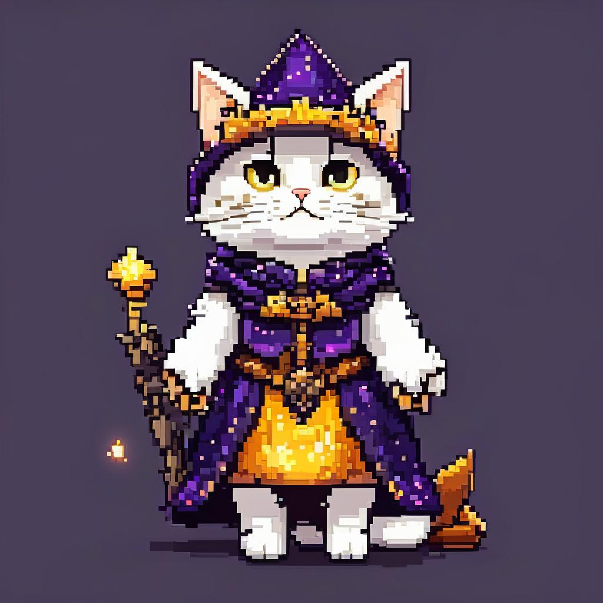
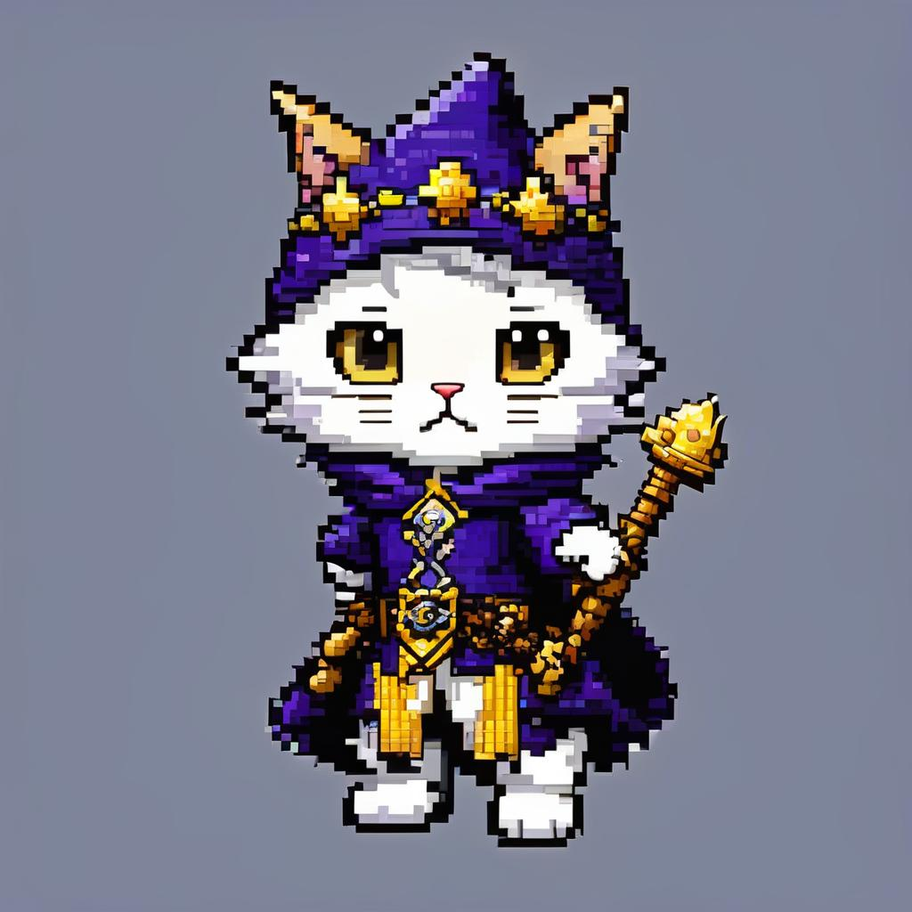
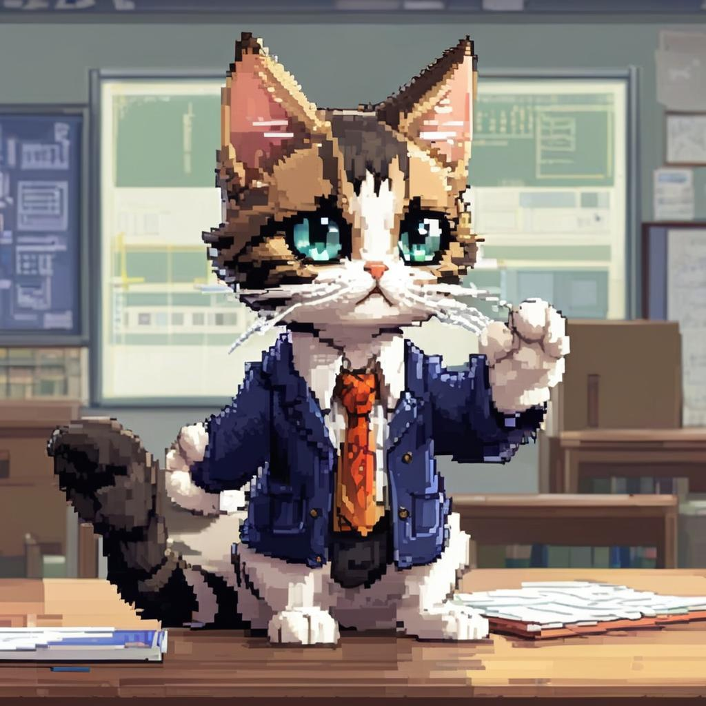
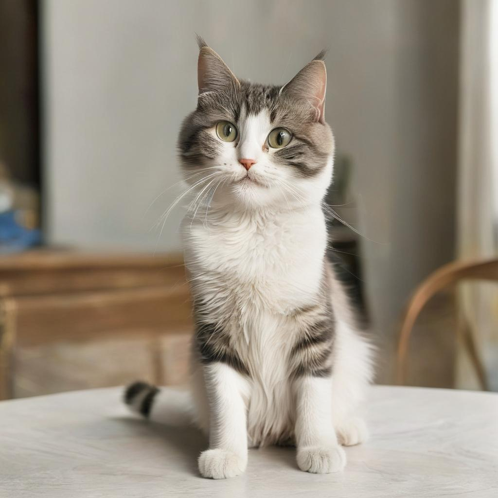

I regret to inform you that I've been playing around with AI art and I've been having a great time doing so.

I think it's accurate to say that [I'm an AI skeptic](../why-does-ai-make-me-feel-bad). However, over the past weekend I came down sick and so had some free time on my hands, and so I tried playing around with image-to-text models hosted locally. I have a pretty old (i5-4460) desktop PC that doubles as an occasional gaming PC with a GTX 1070 in it, and I installed Debian on it (for minimum overhead) and played around.

I've definitely learned quite a few things, and I guess this is the post where I talk about them and show off some images of animals wearing clothes that I generated (apparently, that's what I gravitate towards).


```yml
negative_prompt: ugly, poor quality, bad anatomy, bad hands, text, error, missing
  fingers, extra digit, fewer digits, cropped, worst quality, low quality, jpeg artifacts,
  signature, watermark, username, artist name
prompt: golden retriever, sitting on chair, wearing clothes, humanoid, renaissance
  portrait, oil panting, 8k, high definition, crystal clear
```
# How did we get here?
I started this adventure simply because I was interested in building "ChatGPT at Home" - in other words, rather than using ChatGPT the service, I'd try to make my own version. Lately, I've been thinking about the idea of sensor fusion as a skill (somewhat inspired by the [various books I've read on the topic](../consensualism-ecology-personhood-sci-fi)) and one way I'd like to try and implement that idea in my life is to consume information via a single chat-like interface, rather than a smattering of different progressive web applications that all have different rules. 

Last week, I took the first step in this regard by creating a Matrix chat server in my homelab network (running Dendrite) and migrating my most-read RSS feeds to it (RIP Miniflux (you were great) and [ssddanbrown/rss](https://github.com/ssddanbrown/rss) - you were fine). The next increment was to roll my own ChatGPT - I was originally planning to pull a model from [Ollama](https://ollama.ai/library) and write a [Maubot](https://github.com/maubot/maubot) plug-in to track and request chats with it. I tried a few different models on my [NUC5i5MYBE](../nuc) and immediately discovered that having a discrete GPU is an absolute requirement for running modern models. I think the only model I was able to get running to any degree of responsiveness was [StableLM-Zephyr](https://ollama.ai/library/stablelm-zephyr).

That got me on the track of finding a computer with a GPU - after a brief dalliance with WSL (I might still give it a shot, rather than dual-booting), I bit the bullet and installed Debian on my old gaming PC. Unsurprisingly, going from an integrated GPU to an old-ish one but with 8 GB of VRAM did wonders - most 7B parameter models ran adequately, and I was able to get downright usable results on [orca-mini:7b](https://ollama.ai/library/orca-mini/tags).

It was at this point when I realized how much work learning a new chatbot framework would be. I was in a discovery mood rather than an optimization one, so I called it a day, threw $10 at the OpenAI API and implemented the [existing ChatGPT Maubot plugin](https://github.com/williamkray/maubot-chatgpt). I'll come back to this eventually.


```yml
negative_prompt: ugly, poor quality, bad anatomy, bad hands, text, error, missing
  fingers, extra digit, fewer digits, cropped, worst quality, low quality, jpeg artifacts,
  signature, watermark, username, artist name
prompt: sea otter, cowboy hat, cowboy boots, denim jacket, eating pizza, anthropomorphic,
  renaissance portrait, painting
```
# How it started
## SDXL Turbo
I sort of took a YOLO (no pun intended) approach to starting the iteration process. I set up a nice Python environment with `pyenv` and started a Jupyter notebook on a VSCode server that I could SSH into using VSCodium. Then... I just picked a model and went for it. The first one I tried was [Proteus v0.2](https://huggingface.co/dataautogpt3/ProteusV0.2) and it was pretty obvious that my PC couldn't handle it (8GB, it turns out, is not a lot of VRAM when it comes to diffusion models)

The next model I tried was [SDXL-Turbo](https://huggingface.co/stabilityai/sdxl-turbo) - a "lightweight model designed for realtime synthesis" seemed like the right approach for my hardware. And it worked!

Some early experiments using SDXL Turbo - these were created before I implemented the tracking system for prompts and outputs. You can really see the progression here as I learned more about prompting, and just how dense you can make a prompt. Again, this was before the tracking was available, but if I remember correctly these were generated using narrative prompts.





## SSD-1B
I was playing with SDXL Turbo in a WSL environment, but a funny thing happened once I installed Debian - SDXL Turbo started hitting OOM errors! It's a little inexplicable, since the overhead of WSL (3-ish GB of RAM idling) is undeniably higher than headless Debian (~200 MB of RAM idling). I've yet to quite figure out why, but my leading suspicions are either that some default on Linux platform is higher than it is on WSL, or that Microsoft has built some kind of optimizations into the Linux kernel they use for WSL; this sort of has an impact on my plans long term - eventually I'll want to use that PC to play games again; do I go back to Windows and use WSL, or do I dual boot instead?

The good news is, this forced to think a bit more critically about the actual capacity of my system. I understood that my system couldn't quite handle Proteus - but an aggressively distilled model like SDXL Turbo was fair game. I could also tell from the tensor file sizes that Proteus was a significantly larger model than SDXL Turbo, and Proteus' own model card places it above SDXL base in terms of performance and complexity.

So - all this lead me to try out [SSD-1B](https://huggingface.co/segmind/SSD-1B) from Segmind - a distilled version of SDXL that is 50% smaller with 60% faster inference (their claim).

It works! And it works shockingly well. Here was my first (very naive) attempt with SSD-1B, a Simple Cat Photo.


## Other Models
I also tried [Stable Diffusion 1.5](https://huggingface.co/runwayml/stable-diffusion-v1-5) and [Stable Diffusion 2.1](https://huggingface.co/stabilityai/stable-diffusion-2-1).

The gulf in out-of-the-box performance between these models and SSD-1B (and SDXL in general) was glaring - while these days it seems like every change in AI is a sea change, this feels very true about SDXL, and as SSD-1B demonstrates, not all of this can be attributed simply to additional resources being shoveled into the fire.

Here's an example of a prompt that I ran through SSD-1B, and similar versions in SD 1.5 and SD 2.1.

```yml
negative_prompt: ugly, poor quality, bad anatomy, bad hands, text, error, missing
  fingers, extra digit, fewer digits, cropped, worst quality, low quality, jpeg artifacts,
  signature, watermark, username, artist name
prompt: otter, cowboy hat, cowboy boots, eating pizza, wallace and gromit, clay, 8k,
  no tail
```

SSD-1B:


SD-1.5:


SD-2.1:


# How it's going
## Code Optimizations
So yeah, SSD-1B is where it's at in terms of quality for a model that my GPU can actually run. Along the way I've made a few other optimizations:

First, I set the CFG (aka `guidance_scale`) to 12. It seems that CFG is sort of an experimental thing - SDXL Turbo doesn't use it all, most other models recommend somewhere betwee 5 and 10. Segmind [recommends](https://blog.segmind.com/best-settings-for/) a setting between 12 and 17, and I chose a value on lower side for no good reason (side note - the benchmarking for image quality that many models uses is understandably subjective). Overall, I'm not often generating the same prompt with different values for CFG, so I didn't notice much of a change.

Next, I implemented the UniPC scheduler - compared to the default scheduler, this cut the time it takes for inference by something like 50% - a huge difference! I also tried the Euler Ancestral scheduler (basically indistinguishable from UniPC to my eye, and about the same speed) as well as the PNDM scheduler (about the same amount of time, but more noise for the same number of inference rounds).

I also enabled some common code-level optimizations - VAE tiling, VAE slicing, and Flash Attention (aka Memory Efficient Attention). I took a shotgun approach with these, I have no idea what impact, if any they made, or even if they are being used (VAE slicing, iirc is mostly used for batching images). I may also try model offloading or CPU offloading once I get a better CPU - I've seen before that compared to a GTX-1070, the i5-4460 is absolutely a bottleneck in my system.

I also implemented Prompt Embeddings, both for the negative and positive prompts. I think that this scratches the "text is an inefficient communication medium" itch that I expressed in [my AI kvetching post](../why-does-ai-make-me-feel-bad) - it feels like a reasonable way to operationalize the prompts in a machine-channel way.

Finally, I defaulted the image size to 768 x 768 and inference steps to 30. All in all, this results in about 1 iteration per second, or about 30 seconds to generate an image. My first attempts with SSD-1B took 5 minutes per image, so not bad!


```yml
negative_prompt: cars, ugly, poor quality, bad anatomy, bad hands, text, error, missing
  fingers, extra digit, fewer digits, cropped, worst quality, low quality, jpeg artifacts,
  signature, watermark, username, artist name
prompt: owl,anthropomorphic,groceries,(headphones)++,(sunset)++,busy city street,normcore,
  cozy,happy,(watercolor)+,backlit,high quality
```
## Process/Tooling Optimizations
A few cool process related improvements I've made:

1. I've tried a variety of different ways of running a VSCode-like connection between my GPU pc and my Mac mini or MacBook Pro - in particular on my Mac Mini I've made a point of running VSCodium - luckily there is a [OpenVSX Marketplace Extension](https://open-vsx.org/extension/jeanp413/open-remote-ssh) that largely replicates the functionality of Microsoft's own VSCode SSH server
2. The prompt embeddings apparently allow you to operationalize the annotations you see in the prompt above (like `(headphones)++`) - I still don't fully understand why this is the case.
3. For image generated, I write a YML file containing the prompt as well as some other metadata - I understand that this kind of prompt serialization might be available in `langchain` or something similar, but it's certainly been handy as the number of images I have floating round has mushroomed. At some point I'll build directory-level organization into my tooling.
4. I've been playing around with writing prompts in a structured, themed way. Originally, I tried passing this directly to the model (in json) but got worse results, leading me to look into prompt embeddings. However - the structured format seems to help me remember what elements to include in a prompt. An example is below:

```python
args = {
    "theme": "owl",
    "prompt": {
        "subject": ["owl", "anthropomorphic"],
        "outfit": ["groceries", "(headphones)++"],
        "environment": ["(sunset)++", "busy city street"],
        "emotions": ["normcore", "cozy", "happy"],
        "style": ["(pointillism)+", "backlit", "high quality"],
    },
    "negative_prompt": "cars, ugly, poor quality, bad anatomy, bad hands, text, error, missing fingers, extra digit, fewer digits, cropped, worst quality, low quality, jpeg artifacts, signature, watermark, username, artist name",
}
```



## Learnings
Throughout the process, I've definitely learned a few things about AI art in general, the SSD-1B model in particular, and myself. In no particular order...

Style is SO important - it lets you hide the artifacts where the denoise process hasn't done a good job. Some styles are better than others - `photorealistic` I've found is quite bad at hiding flaws, but `watercolor` does an excellent job. `line drawing` is also pretty good.


```yml
negative_prompt: bokeh, short depth of field, ugly, poor quality, bad anatomy, bad
  hands, text, error, missing fingers, extra digit, fewer digits, cropped, worst quality,
  low quality, jpeg artifacts, signature, watermark, username, artist name
prompt: otter, normcore, cozy, daytime alleyway, anthropomorphic, street photography,
  watercolor
```

I don't find humans to be an interesting subject for AI art, at all. I find myself drawn to animals with clothes. Animals with pants, especially, are a unique challenge - the `anthropomorphic` or `humanoid` prompts do an ok of encouraging these animals to put on pants. 


```yml
negative_prompt: ugly, poor quality, bad anatomy, bad hands, text, error, missing
  fingers, extra digit, fewer digits, cropped, worst quality, low quality, jpeg artifacts,
  signature, watermark, username, artist name
prompt: greyhound, sitting on chair, wearing clothes, humanoid, anthropomorphic, renaissance
  portrait, oil panting, 8k, high definition, crystal clear
```

The intuition for how to resolve blurriness in prompts borders on superstition sometimes; I've seen people say things like "all the 8k images in the training set were good, so I put 8k as a prompt to bring that out"


```yml
negative_prompt: ugly, blurry, poor quality, rounded edges, bad anatomy, bad hands,
  text, error, missing fingers, extra digit, fewer digits, cropped, worst quality,
  low quality, normal quality, jpeg artifacts, signature, watermark, username, blurry,
  artist name
prompt: A happy dog wearing 2000s era fashion. 16 bit drawn style bipedal less furry
  less fuzzy 8k normcore cozy
```

Are otters hot? Did I mention how difficult it is to get animals to wear clothes?

```yml
negative_prompt: ugly, poor quality, bad anatomy, bad hands, text, error, missing
  fingers, extra digit, fewer digits, cropped, worst quality, low quality, jpeg artifacts,
  signature, watermark, username, artist name
prompt: otter, cowboy hat, boots, denim jacket, coffee shop, humanoid, 16 bit, SNES,
  8k, high definition, crystal clear
```

# Some other images I like







