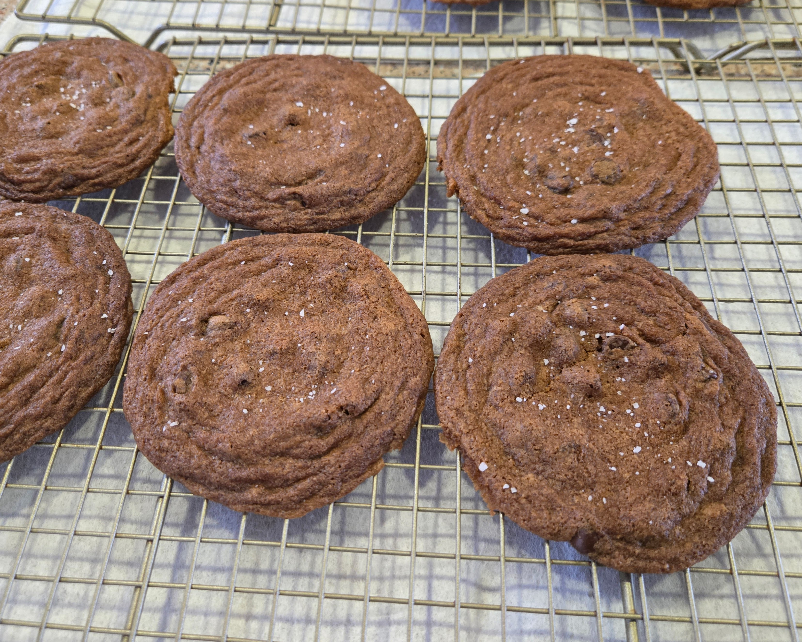
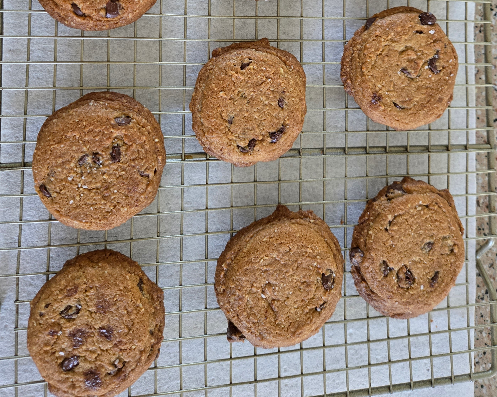
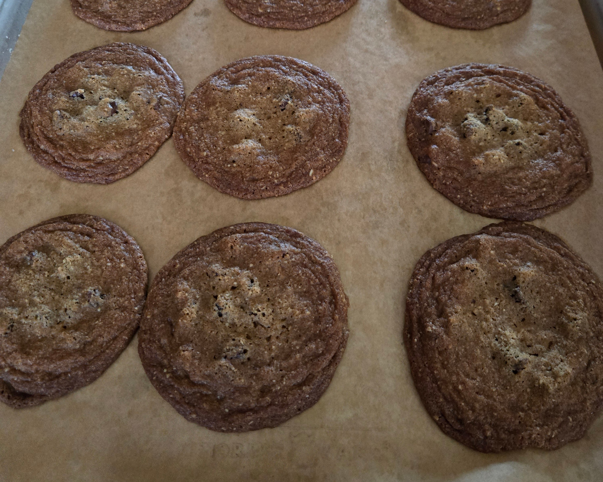

Since [discovering I had some degree of gluten intolerance, as well as heightened sensitivity to dairy](/posts/roasted-vegetables-elimination-diet-allergies), I've been experimenting with my own recipe for chocolate chip cookies that contain minimal amounts of gluten and dairy. 

However, just like a field trip on The Magic School Bus, there's simply no such thing as a normal blog post on this website, so of course the coda to the recipe is going to be a lengthy exploration about the nature of craft, and the (synonymous) aesthetics of AI and fascism.

But first, in the [proud tradition of the other recipe on my website](/posts/chicken-couscous-recipe), the recipe, which is broadly adapted from [The Food Lab's own excellent recipe (and accompanying existential crisis)](https://www.seriouseats.com/the-food-lab-best-chocolate-chip-cookie-recipe), and makes about 18 cookies.

# A Recipe for (Mostly) Gluten and Dairy Free Chocolate Chip Cookies
## Ingredients
- 60g refined coconut oil, room temperature
- 60g butter-flavored spread (I use [Trader Joe's Organic Buttery Plant-Based Spread](https://www.traderjoes.com/home/products/pdp/organic-buttery-plant-based-spread-075762)), room temperature
- 100g white rice flour
- 40g gluten free oat flour (for a more oat-flavored cookie, instead used finely blended/ground whole oats)
- 1/3 teaspoon of xanthan gum
- 6g kosher salt
- 60g white granulated sugar
- 60g dark brown sugar
- 120g chocolate chips (use a dairy-free version if you're extremely sensitive to dairy)
- 1 teaspoon vanilla extract
- 1 large egg, room temperature
- 1/2 teaspoon baking soda
## Equipment
- Oven
- Spatula or spoon, for mixing (you can also use a stand mixer or hand mixer, if you have one)
- Refrigerator
- Parchment paper
- 1 ounce portion scoop (a standard ice creak scoop is about 2oz, so if you use one of those be prepared to bake for a little longer)
- One or more aluminum baking sheets (I like the [Nordicware Naturals Big Sheet Baking Pan](https://www.nordicware.com/products/naturals-big-sheet-baking-pan/))
- Plastic wrap
- Large mixing bowl
- Cooling racks
## Procedure
- Combine the coconut oil, butter flavored spread, and white and brown sugar in the mixing bowl. Use the spoon or mixer to cream the sugar into the fat until it's a uniform substance and no unincorporated fat can be seen.
- Add the egg and vanilla extract into bowl and mix until uniform.
- Add the rice flour, oat flour, xanthan gum, kosher salt, and baking soda to the bowl. Mix until uniform.
- Fold in the chocolate chips into the dough.
- Cover the bowl using plastic wrap and refrigerate for at least two hours.
- Preheat the oven to 325 degrees F (do not use the convection setting, or adjust accordingly if using a convection oven)
- Place parchment paper on the baking sheet
- Use the portion scoop to place balls of dough directly on the parchment paper. If you're using the Nordicware Naturals Big Sheet Baking Pan, you can place them in a evenly pattern 3 tall and 4 across. Put any unused dough back into the fridge.
- Once the oven is pre-heated, put the pan in the oven.
- After 6-7 minutes, rotate the pan 180 degrees in the oven.
- After another 6-7 minutes, remove the pan from the oven. The cookies should be slightly darker than golden brown, spread out to wider circles, soft at the edges, and liquid-like in the center.
- Let the cookies cool on the pan for about 5 minutes, then remove to a cooling rack.
- Ensure the pan is cool to the touch before making another batch of cookies from the same dough.

# The Results
This recipe is meant to create a thin, somewhat crispy, well-salted, and rich cookie. It's not going to be a doughy or tall cookie (a la Crumbl), nor will it be shatteringly thin. The addition of oat flour adds body and some oat flavor, but it doesn't taste like an oatmeal cookie. 

The first iteration of this cookie followed the Food Lab recipe faithfully, but simply replaced the flour 1:1 with white rice flour. The resultant dough was too runny to scoop, and so I added some corn starch by eye until the dough came together.

Here's the result:

The smell was perfectly buttery (I had suspected that using 100% buttery spread would lead to an overwhelming buttery smell), but the texture was a little gritty and sticky. So, for the next iteration, I incorporated some finely blended oats, and used less sugar, since sugar acts as a liquid when baking.

I overcompensated for the second batch. It was definitely no longer gritty or sticky. But, it was far too cakey, and they didn't spread the way that I wanted them to. 1:1 oat:rice flour yielded something that tasted distinctly of oats, and reducing the sugar made them more cylindrical than I'd prefer. Fresh out of the oven, they were actually domed, so I pushed them down using a flat spatula.

As it turns out - the third time is the charm! This time, they spread out more, and the texture wasn't gritty or sticky, but rather soft (as I understand, the xanthan gum really helps with the texure). I especially like that just a little dough clung to the chocolate, so you can see the individual chips as little domed irregularities.

# My Own Rule of Threes
Here's the thing - this is probably not the final form that these cookies will take. The more I do it, the more I learn, and the more ideas that I get. If I want a perfectly made chocolate chip cookie, I'll just go buy one from a bakery, which has bakers that have been doing this far longer than I have. The joy of these cookies is in their production, not necessarily in their result.

Overall, I've noticed that it takes me a few tries to create a satisfactory product, and I chalk this up to the learning process. For something extremely simple like these cookies, it took three fast iterations (and several hours of reading and research) to produce something that I liked.

I assert that this metaphor can be extended to other domains. For example - my [current homelab iteration](/posts/homelab-3.0) happens to be the third, and the second and first iterations were various degrees of experimentation that didn't work out, but to teach me a lot about how not to do things.

Another example - this happens to be the [third iteration of my blog](/posts/goodbye-hugo-hello-astro). The first - hosted WordPress, the second - Hugo, the third - Astro. Again, each iteration taught me a lot about how not to do things, and now I feel like the current architecture is the most fluent and ergonomic for how I like to work and build.

The TL;DR of it all is that when you make things, the process of evolution and iteration leads to better outcomes not because things naturally get better over time, but because you learn more about how things work. Things get better because *you* get better.

# Innate Genius Doesn't Exist
If your understanding of achievement is that iteration leads to learning, then it follows that nobody is born with unknowably deep innate brilliance. Instead, the most virtuosic of people in any given field are simply those that have been able to do it the most.

Mozart, for example, was born into [a family of musicians](https://en.wikipedia.org/wiki/Wolfgang_Amadeus_Mozart#Early_life) - his father a composer and music teacher. Albert Einstein's father and uncle founded a company that manufactured electrical equipment, and Einstein [often attributed his fascination with electromagnetism](https://en.wikipedia.org/wiki/Albert_Einstein#Childhood,_youth_and_education) to an instance where his father gifted him a compass, and had an accomplished [private tutor in Max Talmey](https://en.wikipedia.org/wiki/Max_Talmey).

I can go on and on, but the more you look, the more you'll find that the tendency is that people who achieve highly tend to come from backgrounds with middling (or even better) achievements in the same. And, of course, people that come from these backgrounds inevitably have the resources and freedom to pursue their intellectual pursuits.

Interestingly, I think that partial exception to this rule may be found in professional atheletes. Michael Phelps famously [has disproportionately long arms, double jointed ankles, and likely some difference in lactic acid processing](https://www.scientificamerican.com/article/what-makes-michael-phelps-so-good1/) that provide a distinct and measurable advantage in competitive swimming. 

And yet, while it is tempting to call this a clean exception, is genetics not correlated with the concept of one's "background" as much as, if not more, the vocation of your parents?

# Achievement vs Aesthetic
So... where does that leave us in this discussion about the merits of different gluten free flour blends (remember - this is a chocolate chip cookie recipe)? 

I think that the simplest way to understand why things built from expertise are valuable is to examine what happens if you build things without expertise, or with the hollow appearance of expertise.

## Extraordinary Claims Require Evidence That Stands Up Beyond Cursory Investigation
Carl Sagan had a couple weird years of [worrying about testosterone poisoning](https://en.wikipedia.org/wiki/Testosterone_poisoning), but before that he coined the phrase "Extraordinary claim require extraordinary evidence" - a sentiment itself [first characterized by David Hume](https://en.wikipedia.org/wiki/Of_Miracles) when discussing the necessary conditions to accept that a miracle has occurred. It is also occasionally attributed to Pierre-Simon Laplace, and was also used in another form a year prior by sociology professor [Marcello Truzi](https://en.wikipedia.org/wiki/Marcello_Truzzi).

The point is, if we're to accept that someone possesses extraordinary ability, we need proof of that ability. As much is evident when you watch Michael Phelps swim or review statistics of his performance in competition. But - what happens if someone claims to possess extraordinary ability, submits their own proof, and falls flat on their face?

The technical term for this is "getting high on your own supply" (coined by [Michelle Pfeifer's Elvira Hancock in Scarface](https://tvtropes.org/pmwiki/pmwiki.php/Main/GettingHighOnTheirOwnSupply)), and the medically indicated cure for it is relentless, unstopping mockery.

Far from the newest member of this club, I think that [Elon Musk](https://www.theverge.com/news/645131/elon-musk-path-of-exile-2-livestream) needs a reminder of what happens when you invest your entire emotional being into being a "competent white man" (Darren Beattie), only to get publicly pants-ed and reminded of what you really are - a fake, a phony ([Holden Caulfield, regrettably](https://en.wikipedia.org/wiki/Holden_Caulfield)), a poser of the highest order.

The worst part of it all (well, the second worst; the worst is the fascism) is that it would be easy to move on from this - just admit you're not that good at the game, but enjoy it anyway. That's how most people play games.

## The "AI" Aesthetic
The idea of using LLMs to "democratize" art is based on the notion that learning to make art is hard, and so it's good to make it easier for everyone. And yet - it's not like art doesn't exist, including popular art, which of course exists in many forms. Who's been making all this art, and can we get them to make it for others?

As it turns out - yes, you can pay an artist to make art for you. People have been doing it for centuries. You see, the thing that is un-"democratic" about paying artists to make art is the transfer of wealth from the patron to the artist. The patron is a hard-working, competent white man who just wants a nice picture to put in their Medium article about starting a life coaching business that neatly conveys the specific struggles of their unique business model. The artist is a shameless gatekeeper charging an extortionate fare for their work.

I'm speaking sarcastically, of course. Indirectly, as it turns out, the thing you pay artists for is not their finished product, but their experience, vision, and taste, all of which come from iteration and achievement. If you need a picture of a logo-less coffee mug sitting on a plain wooden table, there's plenty of stock photography out there, and some of it is even in the public domain! And, if you feel like you need an image drawn in the particular style of a particular artist, then you're best off going to that artist, or someone who they've deeply inspired with their experience, vision and taste.

In the case of [OpenAI's Studio Ghibli-esque image generator controversy](https://www.theverge.com/openai/636529/images-chatgpt-openai-studio-ghibli-copyright) or [OpenAI's Barbie Box Challenge controversy](https://www.theverge.com/news/647356/chatgpt-ai-barbie-action-figure-viral-trend), the result is the same - unrecognizable in context (in the case of Ghibli, the joy of the animation is the characters, their movement through space, and the stories behind them), impersonal and inhuman, distressingly uniform in body size and manner of dress, and with a glossy sheen that consistently betrays its origin.

Perhaps Studio Ghibli's own Hayao Miyazaki put it best: 

> “I am utterly disgusted. If you really want to make creepy stuff, you can go ahead and do it, but I would never wish to incorporate this technology into my work at all. I strongly feel that this is an insult to life itself.”