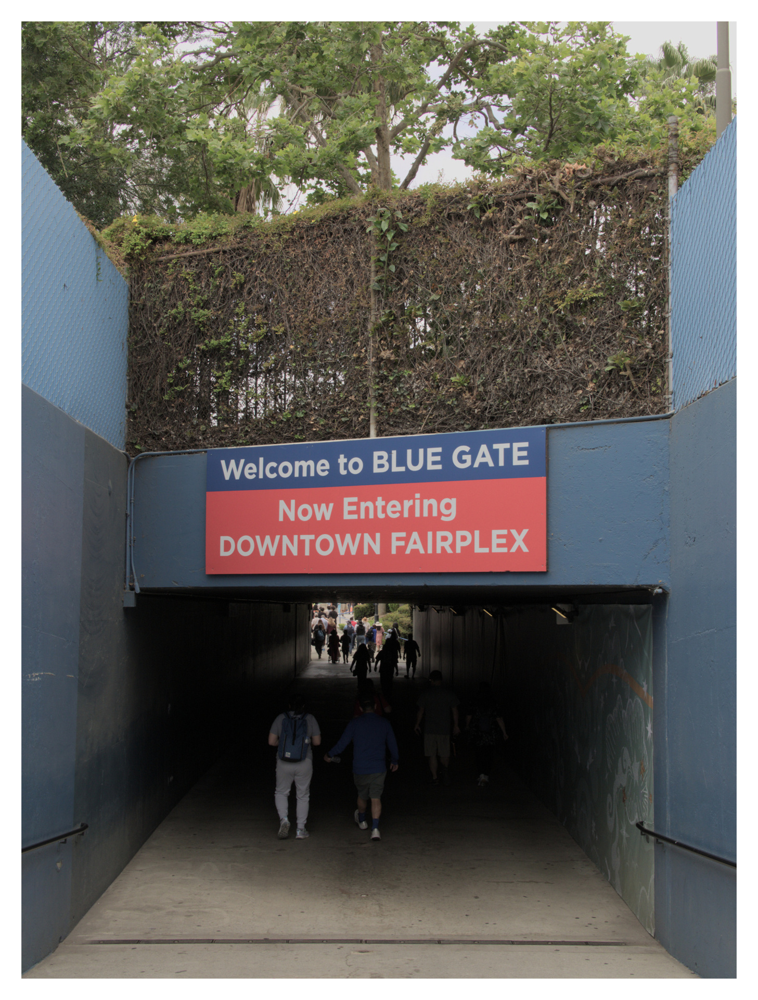
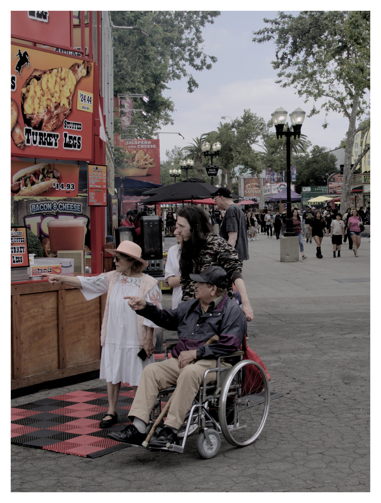
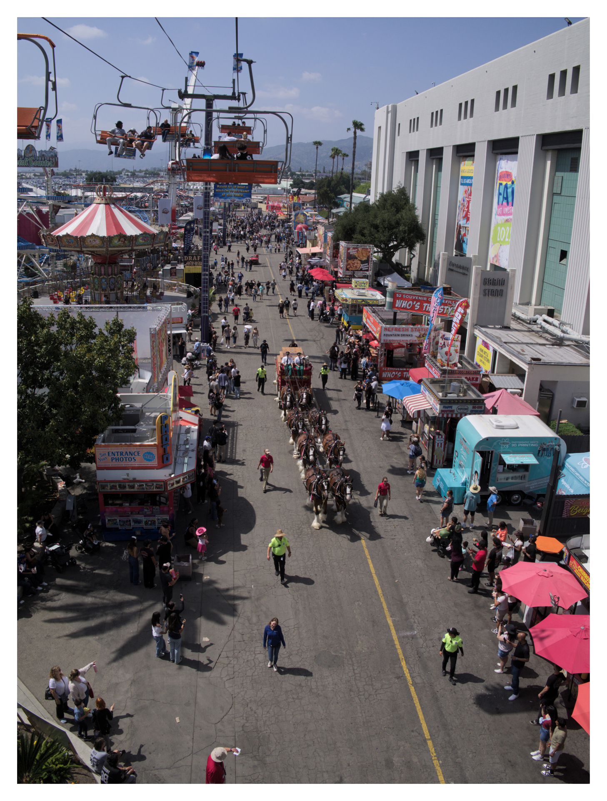
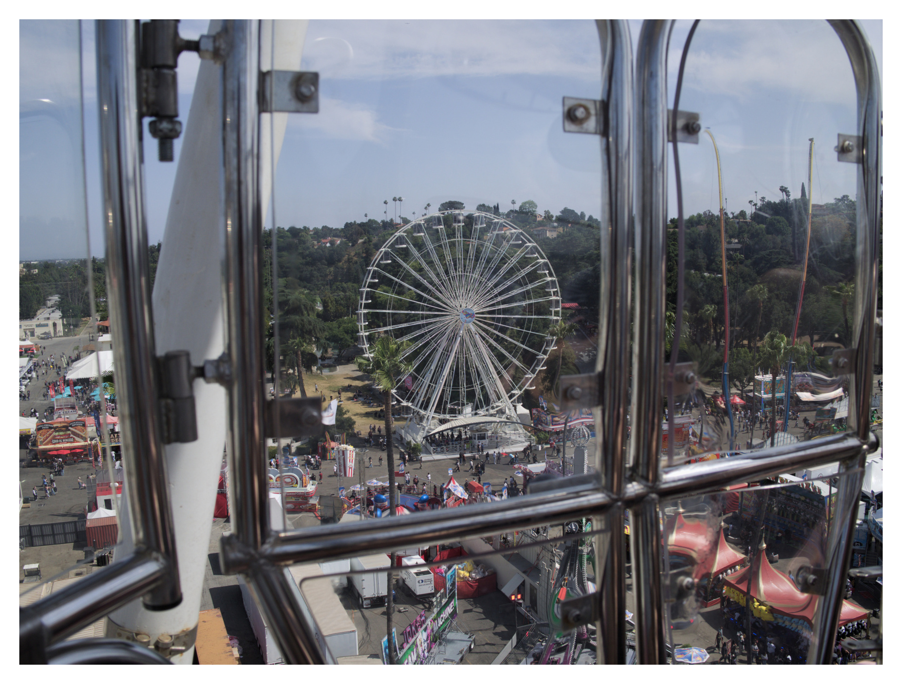
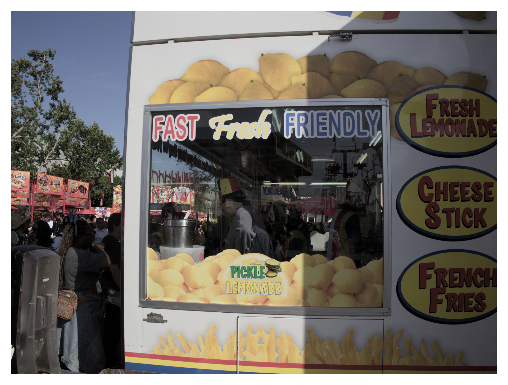
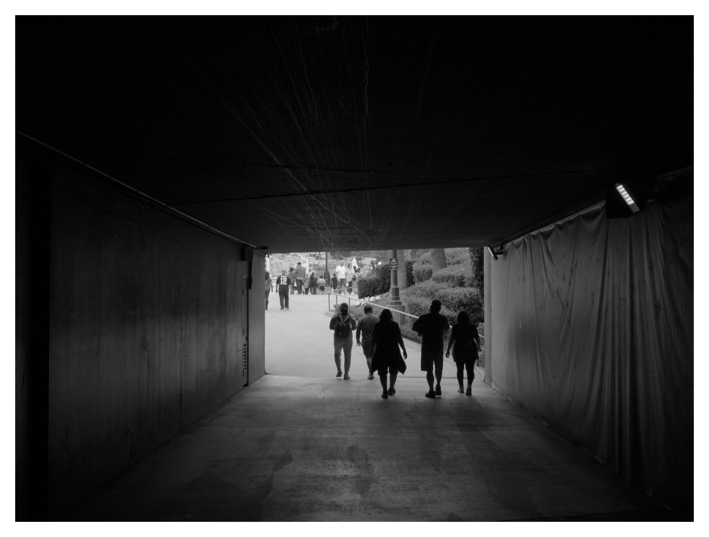
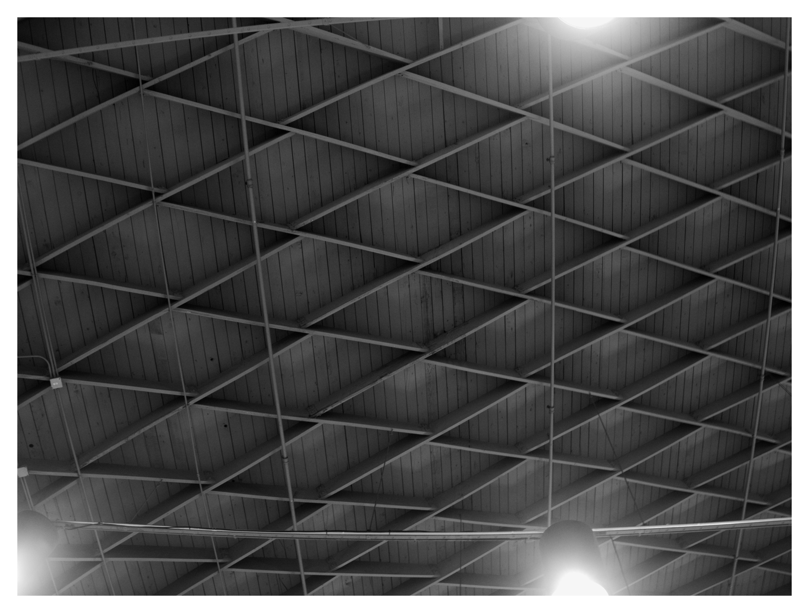
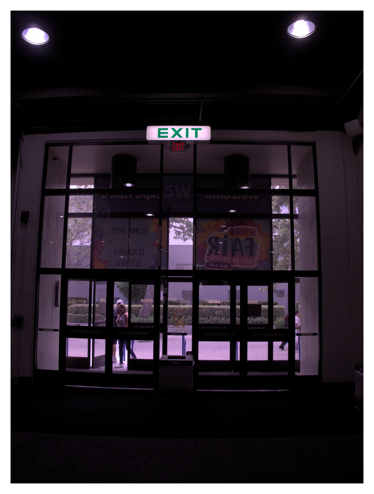
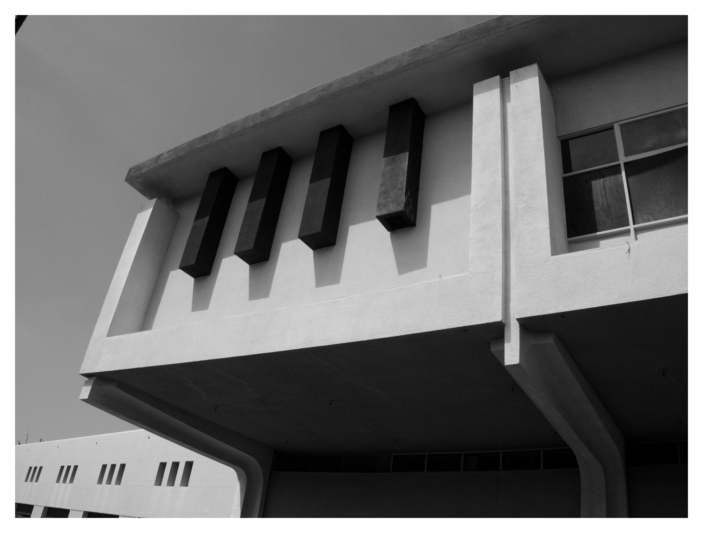
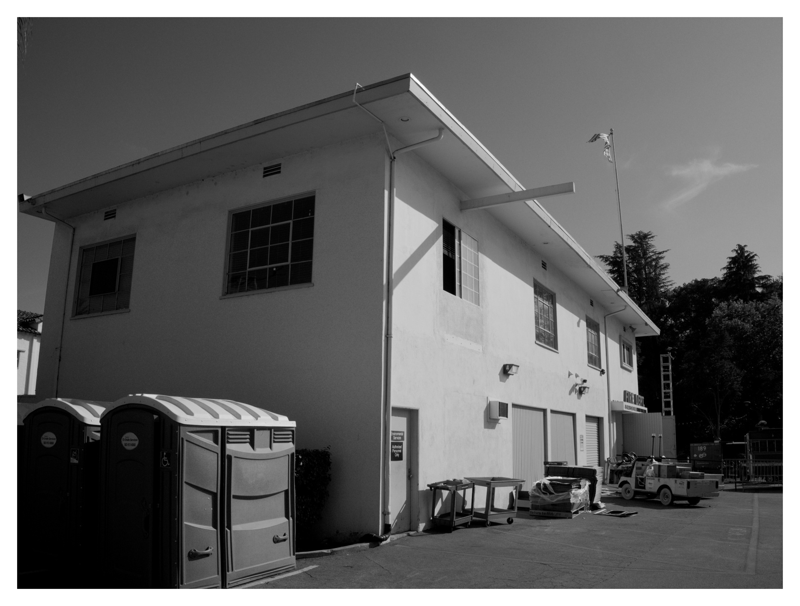

Your eyes do not deceive you - there is a new item in the (now even more overflowing) nav bar! This website now supports [Galleries!](/gallery)!

Now that photography seems to have taken hold as a current hobby of mine, making a gallery feature made sense for quite a few reasons:
- I take a lot of pictures and don't want to necessarily put them all into the blog posts discussing the event
- With Astro I get a decent amount of control over image processing (definitely moreso than Google Photos), and I wanted a place to put them where they don't get mangled too much by compression.
- I get the feeling that I'll be doing a fair amount of travel/location oriented photography, so this is a nice way to showcase my travels.

The new Galleries feature includes the ability to define alt text, a cover photo, and commentary for different pictures as configuration, so I can do it async of the writing process. In addition to a card for the gallery itself, each gallery also has a dedicated page, and each photo has a lightbox page. The lightbox page in particular is optimized to have the most minimal compression. A new learning - by convention, setting jpg quality to 95 in most clients that adopt a numerical quality configuration is the best balance of compression and quality; setting quality to 100 apparently disables some relatively low-loss compression and yields needlessly large file sizes. Does this make sense? Not any more than having a numeric scale for quality at all does, but things become convention independent of sense, sometimes.

Every time I build a new website feature, I get a burst of energy for hosting my own infrastructure, and this project has been no different. In the short-to-medium term, I'd like to find a way to get my website off of Cloudflare Pages. The main reasons being that Cloudflare is approaching monoculture territory when it comes to the infrastructure of the web. This makes it an easy target for enacting censorship and hosting malware. Not ideal. 

I'm thinking that something like Neocities might be a better option for what I need, which is basically dead-simple static site hosting with (now that I'm doing photography) a generous storage allowance. Of course, I wouldn't mind paying for such a service run by good people. Of course, switching my web hosting to Neocities also makes me think of switching my git forge away from Github (speaking of monocultures), which then necessitates replacing CI for deployment... perhaps I'll end up self-hosting that (I briefly had Drone CI on my local network, and it was fun to host CI runners!).

Anyway... back to the fair. Last year was my first time going to the fair, and I had a great time! The highlight was seeing the tablescapes competition; I didn't even know that was a thing! I also had a memorable lunch of ribs that day - memorable for good reasons, although a few of them were rare relative to what you'd expect for ribs (to make it very clear - not raw or unsafe in any way, just not quite right-on-the-cusp-of-falling-off-the-bone).

[Here's a link to the gallery for this trip!](/gallery/county-fair-2025)

Photographically, we'll start with some photos that think do a good job of setting the scene.

And now, here are some photos that I'm proud of artistically.

