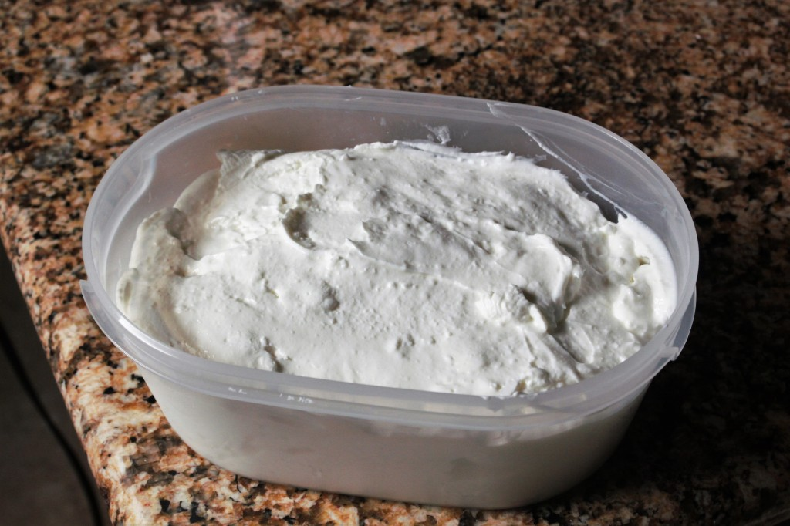

## A note from the future
When I wrote this piece back in 2015, I was living for the first time in a place that had a really nice kitchen and bike commuting to work every day. Really living the Portland dream. I miss it sometimes.

## All About Greek Yogurt

One of things I do is that every now and then, I become obsessed with perfecting a recipe and make it multiple times for the purpose of achieving its platonic ideal. When it comes to food, it takes a pretty specific kind of dish to check all of these boxes. The recipe has to be delicious, obviously, but it also has to be satisfying to make, achieve some kind of efficiency that can’t be achieved by just buying the food outright, and, most critically, meaningful to learn.

Examples of recipes that have fallen into this trend for me are pork shoulder steaks (less expensive than beef, but no restaurant in the world serves it up grilled) and spaghetti alla carbonara (from which I learned my skills rendering fat). You’ll probably also notice that both of these aren’t exactly great for you. Red meat, of course, is something to watch out for, and rendering a pound of bacon and then frying cooked spaghetti in it is the stuff of dietician’s nightmares.

So now for something completely different – my latest obsession is with optimizing a common breakfast item: granola on top of Greek yogurt. There’s a lot of reasons why I think I can do better with granola and greek yogurt, but chief among them is this – neither are particularly labor or time intensive to make, especially once you get the system down.

Growing up, yogurt and granola were intended as a snack, and never consumed together. Being Chinese, the most common breakfast food was usually leftovers from the night before, not that I minded it. It wasn’t really until college that I grew up to the wide variety of breakfast foods out there. When I had a meal plan, my favorite meal of the day was always breakfast, not only for the wide variety of foods available, but also because nobody else really showed up. I could have breakfast with a whole table to myself as I read the newspaper. It was a pretty cool time.

After I graduated, I never really paid much attention to breakfast, even though I was a bike commuter. I would simply roll out of bed, get ready for the day, and head on out the door. Lately, however, I’ve been trying out having breakfast before leaving to work, and I feel noticeably better in the mornings.

Greek yogurt and granola came out of a desire to have something healthy and ready to go for breakfast, but that also required a little craft, or at least more than a prepackaged granola bar and fruit.

This post deals with the yogurt. The principal difference between Greek yogurt and conventional yogurt is that the Greek variety is thicker because the whey liquid has been drained from the yogurt before it is served. This, in my opinion, makes it a better carrier for granola because the action of absorbing water is delayed, which gives you longer to enjoy it before it goes soggy. They sell dedicated yogurt makers on Amazon and at other brick-and-mortar retailers, but I just make it using a single stainless steel pot. It’s also very important to use a thermometer for these operations, which increases the fiddliness, but also makes sure you get consistent results.

## Recipe

1. Pour your milk into a pot. I use a medium sized saucepot for a half gallon of milk, or a medium sized stockpot for a gallon of milk. The milk can be whole or two percent. Fermentation works with skim, but because its the fat and protein that coagulate you lose a lot of volume when you strain.
2. Slowly bring the milk up to a temperature of 185-190 degrees Fahrenheit. You definitely don’t want the milk to boil. If you’ve got the patience, you can heat on medium and constantly whisk to ensure even heat distribution. Or, if you’re like me, you can set the heat on low and walk away to do something else. Make sure you check the temperature about once every 15 minutes until it’s reached about 170 degrees, at which point you should probably stand there and keep watch a little more closely.
3. At 180 degrees, most bacteria in the milk will have died and the proteins in the milk have denatured such that the milk will now solidify into curds when it cools down, instead of separating into whey and disassociated proteins and fats. Pretty cool. Let the milk cool down until it reaches 120 degrees F. Again, you can stir and/or place in the pot in an ice bath, or you can walk away and let Newtonian cooling do it’s thing.
4. At 120 degrees F, the milk is ready to be inoculated with the good bacteria that give yogurt its flavor and health benefits. To start with you should buy a single cup of pre-made Greek yogurt at the store to inoculate. In the future, you can use about 2/3rds of a cup of your own yogurt to kick off the fermentation process. Slowly mix in the yogurt and ensure that it’s evenly distributed. If your pot is quite full, take about a cup of the warmed milk in another bowl and mix the yogurt with that. Then, return to the main pot and stir slowly.
5. Place the pot in a warm place for 4-8 hours. I usually start the batch in the afternoons to wait overnight and wake up early to do the next step, but I’m a morning person. My oven has a light that doesn’t generate much in the way of heat, so I preheat to 150 degrees and then open and close the door quickly three times before putting the yogurt in.
6. When the incubation is done, you should have a slightly shrunken cylindrical mass of yogurt sitting in a thin pool of whey. If you like the thinner style yogurt (which has additional protein and calcium from the whey) you can mix it all together and stop here. However, I like to produce a Greek style yogurt, which is strained to remove excess whey. I take some cheesecloth (for smaller batches a coffee filter also works) and line a colander or strainer before dumping in some drained fresh yogurt (to get rid of the obvious excess whey). I then place that colander or strainer in a raised position in a bowl, which will catch the liquid whey as it drips out of the yogurt.
7. The whole setup goes in the refrigerator to chill and stop the fermentation process. After about four hours, the yogurt will be about as strained as it can get. Remove the yogurt from the strainer into airtight containers for storage. It should last about two weeks in the fridge, but I can usually finish about a half gallons worth of milk in the form of strained yogurt in five days.
