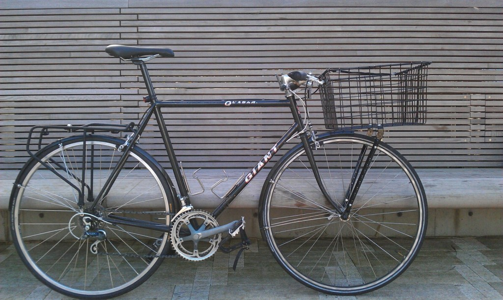
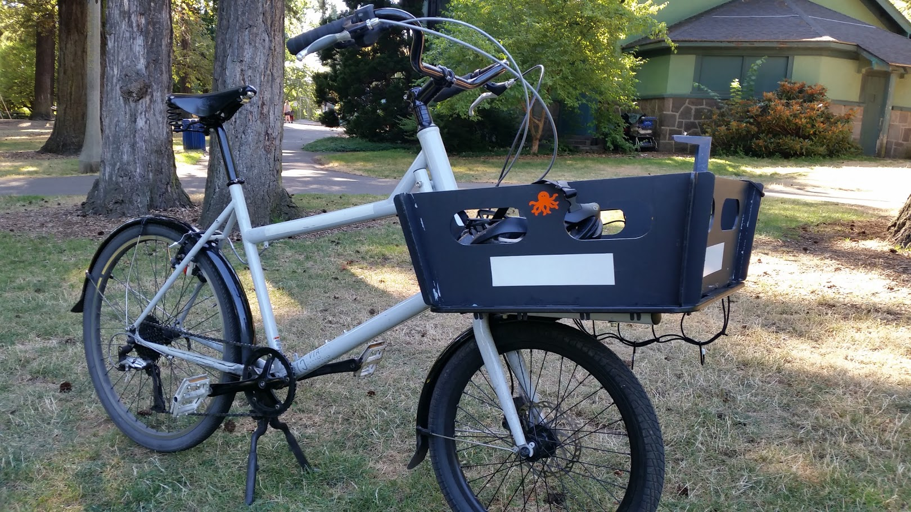
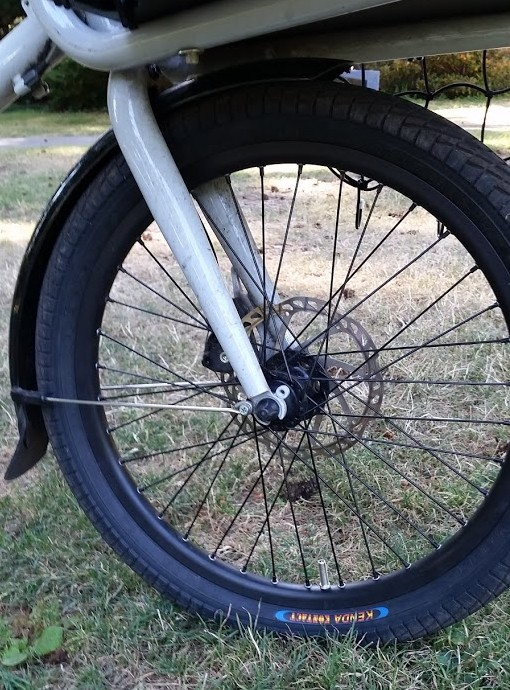

## A Note from the Future

For the span of about two months in 2015, I owned a proper Cycletruck - the Civia Halsted. It was a lovely bike, if susceptible to shimmy in the frontend at speed. I bought it off Craigslist, and looking through my emails from that time, it feels like participating in a golden age for the site. We would just give our addresses out willy nilly, and multiple people I corresponded with would send me updates on their own biking journeys. What a wild time.

I only rode this bike for a single summer before finding a crack in the seat tube. I remember selling it off to a couple who said they were interested in trying to weld it back together. I hope it served them well.

## Civia Halsted: Why Not Cycletrucks?
I recently started riding my first purpose-built cargo bike, the Civia Halsted. In the past, I have built bikes for the express purpose of carrying things, but never have I had a bike that was created specifically for hauling large amounts of stuff a moderate amount of distance (see my Soma Double Cross write-up, or this one below – actually the first bike I built up on my own!).

Back to the Halsted (and it is properly spelled that way – apparently it’s named after a street in Chicago). The virtue of cycletrucks is that they let you keep an eye on the stuff that you’re carrying (by storing it in the front), but at the same time their design is not as radical as a bucket bike. This is great for fitting into small spaces in an urban setting, or even keeping it inside. I am able to store the bike in my basement by carrying it down a flight of stairs, which would simply not be possible with a bucket bike.

At the same time, cycletrucks are able to carry more than porteur-like setups because the cargo load is attached to the frame itself, instead of the fork. This is advantageous because the fork remains unloaded, and thus there is no excess momentum or shimmy when you’re trying to turn. Of course, this also lets you carry more stuff. In the case of the Halsted, the load is cantilevered over the front wheel by two struts that support the high density polyethylene (HDPE) platform.

The platform material choice is quite interesting because it lets you have a platform without any gaps (as porteur racks and baskets have) that is low-profile (unlike wooden platforms), but still reasonably light and tough. The Halsted also has accessory panels that let you form a basket on top of the platform. It rattles a little, but it’s a clever solution that does a good job of keeping things corralled.

I’ve got my Halsted set up with a Brooks B67 saddle (this picture is a Flyer), Ergon racing grips, and a riser stem. Civia only made the frame in one size and, while it’s of appropriate size for someone of my height, it could certainly do better. Unfortunately, adding a longer stem might start intruding into the cargo area. For the moment, I am suited pretty well by the bar height, but if that changes in the future, I might have to get creative. It’s an interesting idiosyncrasy introduced by the decision to produce only one size of frame.

I rode the bike nearly 30 miles today, for Northeast Portland Sunday Parkways. I was pretty sore by the end of the ride, which I think has helped me understand the upper bounds of how far this bike can be ridden. It’s not that the bike is excessively heavy, but it’s so much heavier than anything else I ride that I forget to pace myself correctly and end up running out of sugar fairly quickly. This is also my first bike that has disk brakes (it has a disk in the front, and a v-brake rear). It seems to have developed a bit of a squeak, so I guess I will be teaching myself about how to work with mechanical disk brakes!

