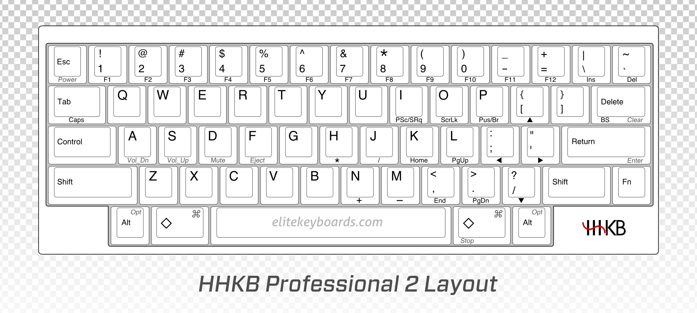
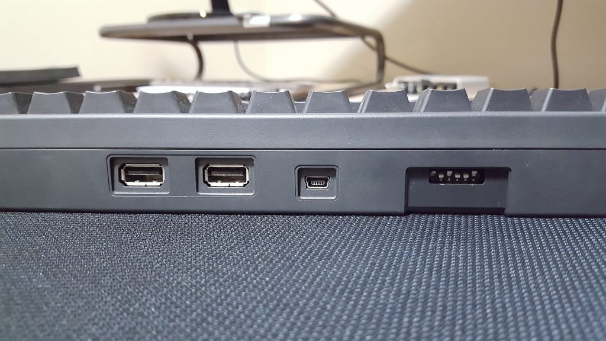
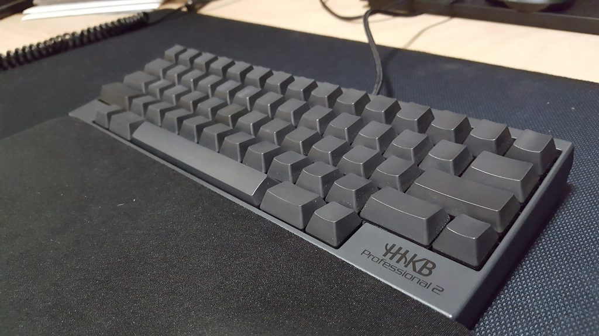

## A note from the future
In the spirit of full disclosure, about a week after I wrote this review, I stopped using the HHKB and switched (back) to the WASD Code TKL with Cherry MX Clear switches. Acclimating to the layout was **hard** and if we're being honest, not having keycap legends really put a damper on my productivity. After that, my next few keyboards were 60% or 70% size with a variety of switches - MX Clears, Matias Tactile, Gateron Brown in that order.

By late 2022, I was back to a KBP V60 with Cherry MX Clears - which all of a sudden developed a double key-press issue. Having sold most of my keyboards when I moved from Seattle to LA, I decided to give the HHKB another chance. This time, I didn't let my pride get the best of me, and I bought a set of stock keycaps in white with legends. 

Another factor to consider - around late 2020, I switched my work computer to use a Mac. I think that this makes a difference especially because MacOS doesn't have a Windows key at all and a very clear separation of duties between CTRL and CMD - because CTRL is less important, it makes using the mapping of CTRL to the caps lock position much more usable.

## A review of the HHKB2
There’s a term in engineering called a “1% Solution”. 1% solutions solve a problem that only 1% of the population has. Implied in the term is an excess of effort for the associated reward – if only 1% of people can appreciate what you’ve built, why build it at all?

The [Happy Hacking Keyboard Professional 2 (HHKB2)](https://en.wikipedia.org/wiki/Happy_Hacking_Keyboard) is not a keyboard for most people, but for 1% of people, it is the solution to a problem that most people don’t even know exists.

## Defining the Problem
When most people first think of a keyboard, they probably think of the one attached to their laptop, or perhaps the one that came included with their desktop. A few people will think of ergonomic keyboards that adopt strange shapes in the name of comfort. Others will think of gaming keyboards that have such features as macro keys and wild RGB backlighting. A yet smaller population will gravitate towards typist-focused mechanical keyboards, the ones that use Cherry MX-type switches.

For all of the engineering innovation that has infused keyboard technology over the past 150 years (dating back to 1873, when Christopher Latham Sholes invented the QWERTY keyboard, having previously experimented with a number of other layouts), not much design innovation has accompanied it, especially in the last thirty years. By and large, keyboards from the early days of computers look very much like the keyboards of today (excepting the radical ergonomic designs that come around every now and then). A few buttons have come and gone (goodbye SUPER and META, hello WIN and ALT/OPTION), but you can hand a standard keyboard to most any time traveller from the 70s and they would largely understand what is going on.

While alternative keyboard formats such as Dvorak and Colemak have been around since the 1930s, the last two decades have seen an influx of QWERTY based alt formats that try to promote some kind of efficiency without forsaking the prototypical keyboard layout on which most typists learn to type. Among these have been the ascent of so-called 60% keyboards, which seek to shrink the overall size of keyboards without compromising functionality. Some features that are relegated to a secondary function layer in these layouts – the function row, navigation cluster, home/end/delete/insert/pageup/pagedown buttons, and the numpad.

The HHKB2 takes the 60% ideal further – how do we achieve some of the ergonomic efficiency of alt keyboards while still retaining a compact and portable form factor?

## The Layout

### How It’s Different
As the name suggests, the HHKB2 is the second in a line of Happy Hacking Keyboards. More accurately, it is actually the fifth: the original Happy Hacking Keyboard, Happy Hacking Keyboard Lite and Lite 2, and Happy Hacking Keyboard Professional all precede the HHKB2.

As this excellent interview with it’s designer, Eiiti Wada, explains, the goal of the original HHKB and its descendants is to adapt the QWERTY layout and add some ergonomic and utilitarian touches. To do this, it makes some peculiar deviations from a typical keyboard layout:

- As is usually the case with 60% keyboards, there is no function row, navigation cluster, or numpad
- In the bottom row, there is one alt/meta key and one win/super key on each side of the keyboard. Other than the spacebar, these are the only keys on the bottom row
- Control replaces Caps Lock on the primary layer
- Escape replaces tilde/backquote, which is placed to the right of plus/equal
- Right shift is shortened, and a FN layer key is placed to the right of it
- Delete and backspace share a key, and is switched in position with the backslash/pipe delimiter button

From an ergonomic standpoint, some of these make more sense than others. Moving delete/backspace into row 2 is the best of them. Instead of having to stretch or remove your hand from home row to correct a mistake, you can hit backspace with your pinkie. This is not only more comfortable, but also faster because you don’t have to reset your hands on the home row after making a correction.

Truncating the function row, nav cluster, and numpad also make sense from an ergonomic standpoint because it allows your mouse hand to be closer to the centerline of your body. The keyboard itself is less than 12 inches wide, so an offset of 6 to 8 inches for your mouse hand is not inordinate. Displacing Caps Lock from the primary layer also makes a lot of sense – it is rarely used and more trouble than its worth, given that it has such a large key.

Finally, from a practical standpoint, I can appreciate the wisdom of shortening the right shift. I use it very rarely (and it’s my understanding that this is the case for most people). However, placing the function key to the right of it exposes a problem that I generally have with the keyboard  – its use of bottom row space is inefficient.

### Some Missteps
Whereas standard keyboards have three keys to the left of the spacebar and four to the right, the HHKB has two on each side, an ALT/META and a WIN/SUPER. The only place where Control is accessible is where the caps lock typically resides, and where it would typically reside on the bottom row there is a blank spot on the left, and a printed logo on the right.

This seems like a compromise in functionality. While the placement of the Control key makes it much easier to use control in conjunction with keys in row two, it also makes it unreasonable to use control with the rightmost keys in row four without moving your hand. When it comes to row four, I typically will be using CTRL-C and CTRL-V, for copy and paste, respectively. Having to move my hand and reset my hand breaks the efficiency of the maneuver, whereas with a standard layout I am able to use my left pinkie to depress control and my middle or pointer fingers to press C or V. Pressing X, for cut, is even harder because it requires the pointer finger to swing inward of its resting position.

## Build Quality and Typing Experience
The HHKB2 has an ABS plastic case. It is available in dark grey (functionally black) or white. Compared to most keyboards, the build quality is noticeably superior. The seams between the bottom and top halves of the case, while still visible, are finer than the keyboards that come with most computers. Their visibility is a bit accentuated by the fact that effort is made to hide them – the seam runs almost exactly half way between the bottom and top of the keyboard. Usually, manufacturers will try to place the seam along a hidden area of the keyboard, such that even thought it is present, the seam is not visible. Compared to other enthusiast-grade mechanical keyboards (my two references being the Leopold FC750 and Vortex Pok3r), the build quality is middling at best. Not bad, but the others are just quite good.

Along with a center-mounted mini-USB out, there are two female USB type B inputs on the front of the keyboard. While these are not substantially powered (200 mA limit), they have come in handy for running a USB numpad or a Logitech mini unifying receiver. I suspect that they may also be able to run older USB drives, but not newer ones that have a higher power draw. These limits aside, keyboards with USB hubs are always appreciated.

### All About That Topre
> Another note from the future: did I write this more than two years after Meghan Trainor's "All About That Bass" came out? Yes. Was it top of mind when I was writing? Apparently.

Other than the layout, the HHKB2 is best known for using Topre electrocapacitative switches. These combine a rubber dome with a conductive spring and slider system to provide mechanical-like feedback with each keypress. In my experience, people either love or hate Topre-type switches. The ones that love it think they’re the best switches ever invented, and those that hate it say they feel like any other mediocre rubber dome keyboard.

My take on the switches is that they’re remarkably similar to run-of-the-mill rubber dome keyboards, but with enough feedback to positively affect the experience. They have immediate resistance at the top of the key stroke, and then nearly zero resistance after meeting the actuation point. It is actually quite difficult not to bottom out on the keys when typing with these keys, unlike that which might be the case with Cherry MX Clear, Blue, or Green switches. As a result, the feel is incredibly neutral. You press the button, and it works. There’s no sense that actuating the switch less than fully does anything special.

The return action on the switches is also noticeably different from Cherry-type switches. Cherry switches reset linearly after bottoming out, but Topre switches seem to bounce back more quickly. As they return to the top of their actuation range, they emit a satisfying “thock” sound. The sound from bottoming out the switch is actually negligible. The thock can be silenced by placing O-Rings or dental bands at the top of the slider range itself, which results in an exceptionally quiet keyboard. However, the unsilenced Topre switch is already noticeably quieter than a typical rubber dome keyboard, and for me the thock adds an additional degree of feedback.

### About the Blank Keycaps

> Yet another note from the future: hahahahaha

My particular keyboard has blank keycaps. The HHKB is also available with dark grey keycaps with black printing, or white with black printing and light grey modifiers. All keycaps are PBT (which is typically more satisfying to the touch than ABS and does not yellow or shine) except for the spacebar. The quality is adequate, which is fortunate given that replacement Topre-stem keycaps are few and far in between. The denser nature of PBT certainly helps to improve the tone of the thock.

Personally, the blank keycaps are a bit of a vanity choice. I’ve always wanted to see what it was like to use them, and this has been an interesting experiment. For most typing needs, I now know that I do not look at the keyboard at all. However, for typing passwords in particular using blank keycaps is a bit hit-or-miss. I never realized how many glances I sneak down at my keyboard when typing passwords, if only for comfort.

It is easy enough to type sentences, but the act of typing arbitrary sequences that are not actual words (as is typical of a good password) removes the context and familiarity that touch typing requires. In other words, if you gave me a blank keyboard and asked me to point out any particular key it is likely that I could not do it, but if you show me the home row I can probably type most anything you tell me to.

## In Conclusion
All in all, the HHKB2 is a good experience. As a keyboard, it is incredibly satisfying to type on. The mental vanity of typing on blank keycaps is also a substantial value-add. Some of the departures from a standard layout make a lot of sense (like the backspace/delete key). Some are logical but don’t quite work as well as they ought to (replacing caps lock with control), and finally some (specifically the layout of the bottom row) are inefficient and seem counter to the philosophy of the design.

I would recommend the HHKB to anybody looking for something different, especially if they have extensive experience with other mechanical keyboards. The cost is such that if you don’t have experience with other mechanical keyboards, you’ll probably find yourself questioning the value proposition of what is essentially an extremely refined rubber dome keyboard. However, once you give the layout some thought, and start to think about switch feel, then the value proposition is more straightforward.
