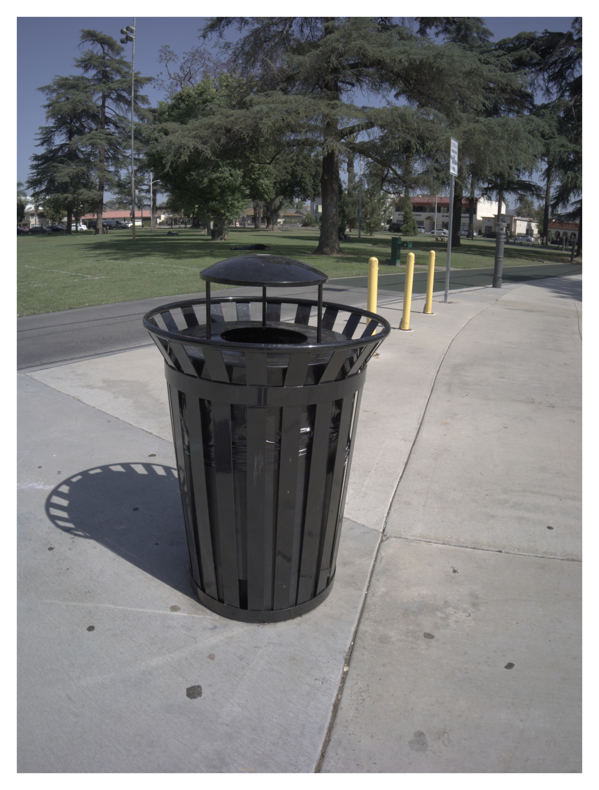

One of my longstanding visual preferences for my photos has been to have a pop of color. Perhaps it's because I'm red/green colorblind, but the distinctly digital look of highly saturated images with high contrast has always been quite pleasing to my eye.

In the interest of trying something different, I set out to try and edit some photos with lower levels of saturation and contrast. The result is distinctly film-like; I think I now understand what people mean when they say that film photos have a certain quality to them. Of course, with the somewhat reduced dynamic range and minimal noise the results are still unmistakably digital, but I got a few good ones in the process!

One last thing before we get into the pictures: I [set up a repo](https://github.com/leozqin/photography-workflow) to store my finishing workflow - namely resizing and adding borders! As I come up with more variants, I'll probably add them there. As an aside, if you're interested in the concept of a Dev Container, I highly recommend distrobox to start! I've started shipping Distrobox-compatible images with my projects.

And now the pictures! I took all of these with an Olympus E-PL6 and AstrHori 10mm f/8 lens.

# Urban Decay

One thing I found is that the film-like look really accentuates scenes of urban decay. For better or worse, these can be found in quantity around Covina.

# Vehicles
As a stylistic choice, I find that red vehicles that would otherwise pop dramatically have a more tempered and liminal feeling when edited with low saturation.

# Miscellaneous
Overall, I find that photos edited in this style feel more documentary than artistic.

# Bonus
Thanks for making it to the end! Here's two more saturated picks that I took along the same walk.

First, the old-fashioned State Farm truck, but edited in a more saturated style that is my first instinct, but I notice that there is some clipping and noise in the sky due to the high contrast.

Then, a view down the stairs to the first floor of my house, in the dark. I really like the exposure of this shot; sometimes the dark can just be dark!

