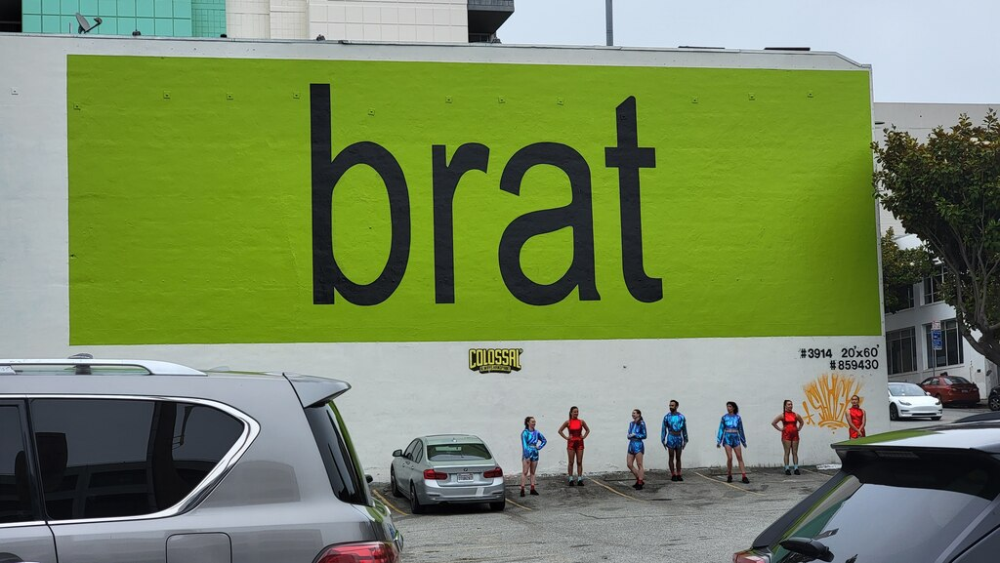

The term "Marginalia" refers to notes, diagrams, and decoration in the margins of the written page. Not necessarily of the same substance as the writing itself, but rather a reflection of the reader's impression and engagement with the text. Since I'm unlikely to write more substantially and meaningfully than a professional sports writer about a game, this piece has more to do with my impression and context of the games that I attended. As the 2024 regular season draws to a close (at least as it relates to my attendance of games), I find myself reflecting on the season through the lens of marginalia.

# May 20 - Diamondbacks at Dodgers
- First Pitch: 7:10pm
- Outcome: Dodgers 6, Diamondbacks 4
- [Box Score](https://www.espn.com/mlb/game/_/gameId/401569180/diamondbacks-dodgers)

My first game of the year, and only Dodgers game, was probably also the most exciting. The immediate context of the game was, of course, the Shohei Ohtani signing. I had watched quite a few Angels games with him and he never failed to disappoint. Even when only playing DH (and not pitching), every time he came up to bat, everyone knew that something exciting was going to happen. And.. it kind of did? He reached twice, first on a pitching error then on a walk. The pitching error in particular was exciting because it went to review.

We should talk about that walk though, because that walk loaded the bases to set up indisputably the play of the game, a grand slam by Freddie Freeman. Going into the game, I had said that the optimal outcome would be to see a grand slam. Low likelihood, but high reward - and yet, we did hit on that reward, immediately followed by a solo homer by Will Smith. After that, the outcome of the game was rarely in doubt.

I say rarely because the Diamondbacks did put up a bit of a fight. I had been to a few Diamondbacks game last year, while travelling in Phoenix, and they were pretty scary! Corbin Carroll is an outstanding base runner, and Ketel Marte was consistently terrifying at bat. And, of course, they made it to the World Series last year, so this matchup with the Dodgers was an obvious highlight for the season.

Finally - I had never seen Yoshinobu Yamamoto pitch before, but he did great - making it into the 6th inning.

# May 24 - Guardians at Angels
- First Pitch: 6:38pm
- Outcome: Guardians 10, Angels 4
- [Box Score](https://www.espn.com/mlb/game/_/gameId/401569231/guardians-angels)

I had watched a few Patrick Sandoval starts for the Angels in the days leading up to this game, mainly just because I had never watched much of him. My impression of him was that he was fine, but seemingly not very clutch (no scientific method for evaluating clutch-ness). That was more or less borne out during this game, as he gave up 6 hits and 8 earned runs, and was chased out in the 3rd. Yikes.

My familiarity with Luis Rengifo was largely the opposite - I had always known him to hit dingers. True to form, he hit a solo home run in the first inning - he actually went 3 for 4, although in the fifth inning he was thrown out reaching for third on a double.

Some other takeaways - 

I was loosely familiar with Josh Naylor, but after this game I am pretty consistently terrified of him. He looks unathletic (especially compared to someone like Rengifo), but he manages to get on base very consistently.

I tried for the first time at this game, eating peanuts at the ballpark, and I'm not sure that I get it. They're SO SALTY, and also a little fiddly to open. I managed to get peanut dust all over myself trying to eat them, and then the act of unceremoniously throwing them on the floor just felt wrong to me.

I ended up leaving early due to my frustration with the kinetics of eating peanuts (and also the fact that the Guardians were up pretty thoroughly). I ended up missing two solo home runs from the Angels, but they didn't end up being meaningful. In a fit of pique, I also ordered the shrimp po boy from the Pacifico Porch because I didn't feel like getting chicken tenders. Bad idea, very bready and hard to eat while seated.

This was my first experience with using Seatgeek - and it more or less worked. I like their system for the rating the value of the price being asked for a seat. It makes it easy to find outliers in the areas where you want to sit. It did, however, mean that I found myself under an overhang in section 208, so I couldn't see where fly balls landed. I could also do without the fees.

# June 30 - Tigers at Angels
- First Pitch: 1:07pm
- Outcome: Tigers 7, Angels 6
- [Box Score](https://www.espn.com/mlb/game/_/gameId/401569727/tigers-angels)

At this point in the season, it was pretty clear that neither the Tigers nor the Angels would be very good this year. My main memory of this game was excitement at finding an excellent set of seats (section 123 Row R) at the last minue, which became a slight regret when I realized that the seats would be in the sun the entire game. It was extremely hot, and I definitely came out of that game with a slight sunburn.

The Tigers went up early - a sacrifice fly by Mark Canha, and then a ground-out RBI by former Angel Gio Urshela (who I had seen in quite a few games last year before he broke his... hip, I think?). Then, Justyn-Henry Malloy hit an inside-the-park home run in the third, which was awesome. It was obvious that the Angels' fielding was somewhat in disarray during that play, but it was very cool to see him turn second, then turn third, and just keep on going! I don't remember his run being contested at the plate, either.

On account of the heat, we left early, after the 7th inning stretch. Luckily the Angels two garbage-time home runs didn't end up changing the outcome of the game, or else I'd feel pretty guilty for leaving early!

# July 27 - Rockies at Giants, Game 1
- First Pitch: 4:05pm
- Outcome: Giants 4, Rockies 1
- [Box Score](https://www.espn.com/mlb/game/_/gameId/401570039/rockies-giants)

When I learned last year that the Giants and Rockies had planned a scheduled doubleheader, I was immediately interested in seeing it. I'd become pretty good at sitting through a baseball game, so what would happen if I challenged myself to sit throught TWO IN A ROW?

At the same time, I had heard that the Giants' stadium is one of the nicest in baseball, and I was overdue a trip to SF anyway. So - when I found a great deal on tickets (Section 125, Row 2), I jumped at the chance.

I flew into SF the day before, giving myself a full day to explore and take in the city. I had already spent extensive amounts of time in the Financial District and SOMA, and a bit in Chinatown, so this time around I prioritized the Castro and Hayes Valley, heading there on the BART straight from the airport after a 6am flight.

I didn't have any concrete plans in the Castro - I got dumplings, took in the sights of such a historically weighty place for queer people, and visited a few bookstores in search of [Boys Weekend by Mattie Lubchansky](https://app.thestorygraph.com/books/f747cbce-e56f-492c-8af9-295f47e0d127) - which, unfortunately, they didn't have, so I ended up buying it online.

After the Castro, I made my way to Hayes Valley (having disembarked from the BART in the Castro, I did all this on foot, by the way - it was like a 20k step day). For whatever reason, on Hayes St between Laguna and Octavia, there is a highly concentrated set of stores that sell bags and tech organizers; on that block alone: Timbuk2, Peak Design, Cotopaxi, and Topo Design. It was like a bag nerd's dream come true.

My general impression was that Topo and Cotopaxi were interesting, but didn't have what I was looking for, Timbuk2 was relatively uninteresting, and Peak Design struck the balance of interest and what I was looking for. I ended up buying their small toiletry bag, to complement the large and small tech pouch of theirs that I already owned. A brief digression - my own experience with being Asian-American [being well-documented](../venba-immigrant-food/) as fairly specific to own family history, I have yet to avoid a slight culture shock when I see other Asian Americans just being "normal people" (interpret these quotes as very weighty and emphatic) - such as is tends to happen in places like the Peak Design store in SF (again - this is a me thing, I know).

Anyway, the day of the game(s), I took a similar route of walking to the game. I spent the morning in the Ferry Building, enjoying the Farmers Market, and then I made my way towards Oracle Park. While meandering around the Ferry Building, I realized that I had bought no jackets at all, and the weather was unlikely to cooperate with my fashion choice. So, I found what I perceived to be the nicest Gap in the world and bought a hoodie and a jacket. I later learned that the Gap corporate offices were above the stores on this block. I also dropped in on the Brat wall and Black Hammer Brewing - which had a number of extremely competent beers, including a dry-hopped lager that I really enjoyed.

The game itself was memorable the most because Blake Snell threw 15 strikeouts - a career high! Except for Matt Chapman, the SF offense was a little sluggish, but you can afford to be sluggish when Blake Snell throws 15 strikeouts for you.

I did have a great time at Oracle Park - they're right to say that it is one of the best in baseball. The food, in particular, was excellent - I went to The Lumpia Company twice - the first time for Lumpia (delicious) and their Calamansi Pilsner (a good pilsner made better by a reasonable amount of calamansi), the second for their Calamansi lemonade, which I can only describe as weapons-grade (seriously, at a later Angels game I got a lemonade and it was sad and flavorless compared to the Calamansi Lemonade).

I also had the lemonade from The Organic Coup, which was also competent, and a Tri-Tip sandwich with Horseradish, which was excellent.

# July 27 - Rockies at Giants, Game 2
- First Pitch: 7:18pm
- Outcome: Giants 5, Rockies 0
- [Box Score](https://www.espn.com/mlb/game/_/gameId/401570040/rockies-giants)

This game was scheduled to start 45 minutes after the end of the previous one. In between, there was a country music concert by Tyler Rich. This was notable not because I was excited by the concert, but rather because my plan was to spend the time between games exploring the stadium, but I got stuck in a mega traffic jam right behind where the band was playing, so I didn't get to see too much.

The game itself was unimpressive - a blowout, with some scoring early, and then the Giants blew the game open in the fifth with three scores.

Midway through the game, the stadium displayed a message saying that BART schedules were disrupted (audible groans from much of the audience). I didn't think much of it until after the game, when I stepped out of the stadium and saw not one or two, but three different trains for the same line roll up to the station at the same time. Very beneficial for my goal of getting back to my hotel, personally, but not ideal for the overall flow of the system. As it turned out, there had been [an electrical fire in Oakland](https://abc7news.com/post/bart-experiencing-major-delay-system-wide-due-equipment/15106845/) that was the root cause of the schedule issues.

They ended up staggering the departures of the trains, so after a bit of waiting I was able to get back to my hotel without much drama.

The next day, I was planning to take BART to the airport, but as it turns out, on Sunday there is no BART service before 8am, so I ended up having to take an Uber. A bit of a letdown at the end of an otherwise stellar trip, but I can empathize with the cost of running the system, I suppose.

# September 1 - Mariners at Angels
- First Pitch: 1:07pm
- Outcome: Angels 3, Mariners 2
- [Box Score](https://www.espn.com/mlb/game/_/gameId/401570527/mariners-angels)

I had participated in the Angels 5K and Fun Run back in July, and as part of that I got two free tickets. I was back up in the 500s now, but hey, the price was right!

One of the highlights of this game was Caden Dana's MLB debut - and he got the win! He did allow a homer to Luke Raley (one of the longest I've ever seen - 437 feet to center), but he got out of trouble and left the game in the 6th.

Another highlight - Ben Joyce. A few days before this, he closed a game against the Dodgers with a strikeout on a 105 mph fastball! Truly an incredible pitch, and when he came out from the bullpen to close, I was quite excited. He was regularly throwing in the 102-103 mph range, and was incredible to see. He closed out the game with a strikeout.

A [Japan trip throwback](/posts/assorted-takes-japan-2024) - several locations of The Corner Store in Angels Stadium have Pocari Sweat, and on this particular day they were running a buy-one-get-one-free promotion. I can't imagine that they sell too many of them (I didn't take advantage), but I suppose at BOGO pricing it's basically the same as buying one at normal price.

# September 15 - Astros at Angels
- First Pitch: 1:07pm
- Outcome: Astros 6, Angels 4
- [Box Score](https://www.espn.com/mlb/game/_/gameId/401570703/astros-angels)

I purchased these tickets using the Coca-Cola Family and Friends Pack promotion - basically for $44 you get four tickets, four soft drinks, and four hot dogs. I'd seen a billboard promo for this, but hadn't taken advantage of it until now. The good news is that it works! 

For future buyers of this promotion: The note on the e-ticket says that you get a $8 food and beverage credit, which is actually less than the cost of a drink and a hot dog. However, if you go a Classic Hits location and mention the promo, they'll know what you're talking about and set it up for you; it truly is a soft drink and a hot dog.

The game itself was a good one for Houston, especially as they put together their playoff run - Ronel Blanco threw a shutout for six innings, former Dodger Jason Heyward was 3-for-3, including a home run. Jeremy Pena went 2-4.

The Angels had a few garbage time home runs, as is tradition.

# September 18 - White Sox at Angels
- First Pitch: 1:07pm
- Outcome: Angels 4, White Sox 3
- [Box Score](https://www.espn.com/mlb/game/_/gameId/401570742/white-sox-angels)

This was the second of the free tickets from the Angels 5K and Fun Run. The main storyline for this game was that the White Sox are 4 games short of tying (5 short of beating) the record of 120 losses in a single season (2003 Detroit Tigers). Facing the last-in-their division Angels with a starting lineup where over half of them weren't with the team at the beginning of the season (or, weren't at a high enough level to make a video feature), this was a bit of a "stoppable force meets movable wall" situation.

In the end, though, the game was competitive - the White Sox went up 1 in the 4th, then the Angels tied it up in the 8th, eventually going 13 innings with a walk-off RBI for Jordyn Adams (apparently voted the best athlete in the Angels organization between 2021 and 2023 - even in the minors more athletic than Shohei Ohtani!).

The first order effect of 4 overtime innings was that it was rush hour when the game let out, and it took me about 90 minutes to get back home (after only 40 to get there!). It was good to see the Rally Monkey make an appearance though, I don't remember it making an appearance in any of the other games I attended, although it must have come up, seeing the garbage time home runs to make the game closer?

Another odd thing about the game (being on a Wednesday afternoon) was that there were not one, not two, but FOUR different school groups. Walking into the stadium, I heard a child remark that they couldn't believe they were allowed to come to this game instead of going to school. There was also seemingly not any rhyme or reason for where the groups were located - one group was in the 500s, another dead center in the 410s, another in the 420s, and the last one in right-center field? I can't help but wonder (with concern) if maybe the ability of the schools to pay made some difference in their placement.

Come to think, there were quite a few children in attendance, either with groups or simply with their parents, seeing as how most cheers came an octave higher than I was used to. Perhaps today was a holiday or early dismissal day for one or more districts in the area.

For the first time in about a year, I had a Big A burger, which was fine (and just as I remembered it). I also had a Halo Light by Brewery X - a very enjoyable lager that I often get. Early in the day, I had gone on the search for the Draft Pick stand, because they apparently had some beers from Chapman Brewing on tap - but, despite the guide saying it should be in Section 240, it was nowhere to be found! Such a shame, I remember being able to try quite a few different beers last year at a Dodgers game from a similar stand.
