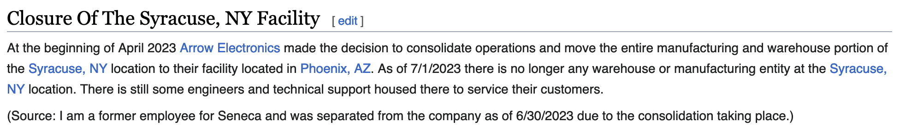

# What is this NUC?
At the time when I am writing this, there exists on eBay a surfeit of extremely inexpensive NUCs - labelled "NUC5i5MYBE". I have personally acquired 2 of them, and am using them in my homelab to host, among other things, [Gitea](https://github.com/go-gitea/gitea), [Drone CI](https://www.drone.io/), and [Uptime Kuma](https://github.com/louislam/uptime-kuma). I could go more into that, but the purpose of this post is to give some details about what exactly these machines are, where they may have come from, and some useful things to know about them.

# What are these machines?
From the pictures provided by the seller, these machines are not Intel-produced reference NUCs. Rather, they appear to produced by SenecaData using the 5th gen i5 NUC package. From the name, there are presumably i3 and i7 versions of this machine available, but I have yet to see them around.

There is not physical evidence on the hardware that SenecaData is the manufacturer of them, but they do strongly resemble other hardware that the company has produced, and there is [some chatter on internet forums](https://forums.servethehome.com/index.php?threads/intel-nuc5i5mybe-i5-5300u-vpro-4gb-ram-custom-case-45.37552/) that they are the manufacturer.

For future reference, you may also find [the technical documentation for the board from Intel here](https://www.intel.com/content/dam/support/us/en/documents/boardsandkits/NUC5i5MYBE_TechProdSpec.pdf)

# What are their eccentricities?
1. Like the reference NUC, they appear to use the standard Intel NUC bios
2. Unlike the reference NUC, they have an internal power supply packaged inside the unit. Therefore, there is no brick needed to power the unit - and they are rectangular in shape and slightly larger than the reference NUC.
3. Unlike the reference NUC, they have an additional fan inside the unit. This fan is connected directly to the SATA power header on the bottom of the unit, so is not addressable as a PWM device.
4. On each side of the unit, there are four screws that hold the side of the case together. On both of the units that I own, two screws appear to be stock flush screws, one screw is too long, and one is missing entirely. This does not really affect the performance of the unit.

This additional fan appears to have been added by the manufacturer out of caution for the additional heat produced by the integrated power supply. However - because it is not addressable by the system, it is always running at 100% so is rather loud.

I have personally disconnected this fan from the SATA power header, and am seeing core temperatures of around 40 degrees C under light load. The BIOS appears to support the whole complement of fan control modes.

Any reports of this hardware being capable of addressing NVME storage appear to be apocryphal - the board on which this unit is based does not support that.

# Where did these come from?
**What follows below is rank speculation - if you have better information that you'd like to share, do not hesistate to get in touch!**

Per [Wikipedia](https://en.wikipedia.org/wiki/Seneca_Data):

> At the beginning of April 2023 Arrow Electronics made the decision to consolidate operations and move the entire manufacturing and warehouse portion of the Syracuse, NY location to their facility located in Phoenix, AZ. As of 7/1/2023 there is no longer any warehouse or manufacturing entity at the Syracuse, NY location. There is still some engineers and technical support housed there to service their customers. 

So - what I think happened here is that Seneca's corporate parent decided to shut down their operations and liquidate any remaining inventory. Not suprisingly, a bunch of NUCs from 2017 are not high on the list of inventory to keep, so they are now being sold by a e-waste recycler - to my benefit, and hopefully yours!

Regrettably, Arrow Electronics appears to be a fundamentally sound, prudently run, and uninteresting business. 👎

Side note: this appears to be a very fresh edit to wikipedia:

