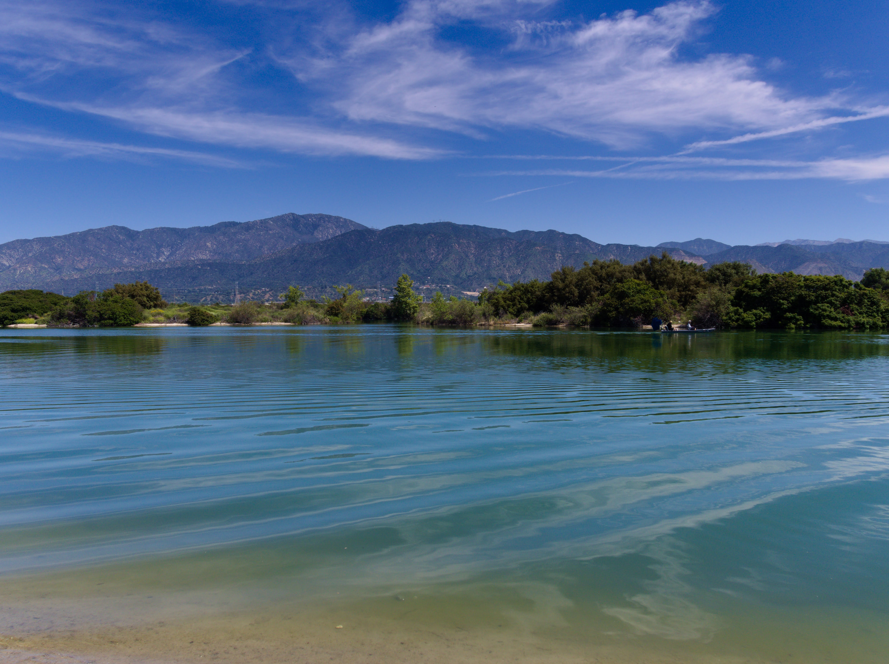

A new format for this website - a collection of photos from my out-and-abouts. In this case, we went to the [Socal Rennaissance Pleasure Faire](https://renfair.com/socal/) in Irwindale.

I took all of these photos using an Olympus E-PL6 and the Olympus M.Zuiko Digital ED 14-42mm f/3.5-5.6 EZ kit lens. It was pleasantly sharp, especially compared to toy lenses like the 7Artisans 18mm f/6.3 II. There is also noticeable softness in the corners when in wide angle, even stopped down.

Overall, I'm quite happy with the photos I took. It's been about 13 years since I last worked with raw file formats, and they've definitely come a long way; the amount of data I was able to recover from highlights was quite impressive.

I edited using [RawTherapee](https://rawtherapee.com/). Overall, I think did an ok job of keeping consistent edits, but I know that my biases tend to be underexposure and excessively high contrast. Perhaps, at some point a consistent bias becomes a style? It's still early days, so I'll keep track of how this develops (no pun intended).

# Setting

# Details

# Happenings

