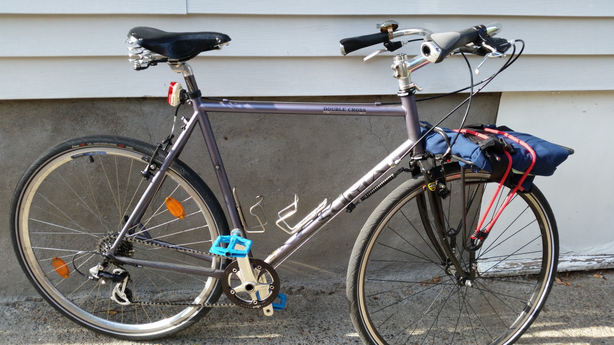
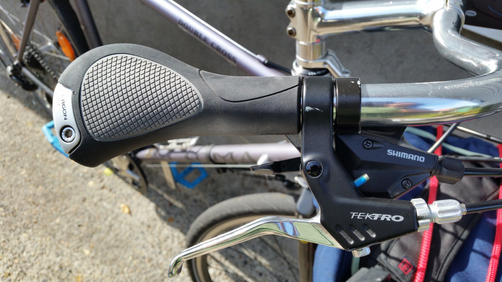
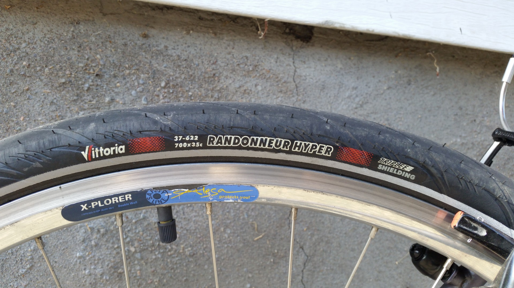

## A Note from the Future
I took a loooooong break from cycling, but have recently gotten back into it. I ended up fixing up this bike to make my return to cycling. The only change is the rear wheel, which was stolen while I was living in Pasadena, and with it the Vittoria Randonneur Hyper 700-35c that I was running. I've since switched it out with the same tire in 700-32c that I was running on my Specialized rainy day commuter bike.

## Bikes I Ride: Soma Double Cross

It’s summer outside, which means that my bikes that don’t have fenders are getting a lot of action right now. Foremost among is this Soma Double Cross, which I’ve built up as an urban cruiser/commuter bike with some neat roadie touches that I can’t seem to give up.

This bike uses a lot of Soma parts, in addition to being a Soma-manufactured frame. They make some quality stuff, and I highly recommend you to give them a shot if you haven’t before.

The bike itself is built around up around a 58cm Soma Double Cross DC frame. I believe it is from 2008, which was the first year they offered the frame with disk brake tabs. I opted to stick with rim brakes so I wouldn’t have to buy new wheels. The fork itself is rim-brake only; sourced from Soma and made of Tange Infinity steel.

’m running a 1×8 Shimano drivetrain, which a 39t chainring mounted on a SRAM GXP crank,with a Spot bash guard on the outside. Outboard bearing bottom brackets are out of the norm for me, as I prefer the general non-fiddliness of square taper bottom brackets. However, this bottom bracket appears to be pretty reliable, and it is noticeably stiffer than the square taper axles that I have. The chainline is also reliably centered. I guess when you build a crankset around a bottom bracket system you can afford to tailor the dimensions to get that kind of result. No more fiddling with different axle sizes!

The wheels are mismatched, although my obsessive compulsion to detail has me thinking about at least switching out some wheels between my bikes so that they are all of uniform color. The rear dropout spacing of the frame is actually 132.5mm, which lets you use both 130mm and 135mm hubs. In theory this is a great idea, but what I’ve found is that to use 135mm hubs in this dropout configuration the wheel actually needs to be dished a little differently than a standard dishing job. It works fine being a little off-center, but every time I see it I wince a little bit.

The rear cassette is a Shimano 11-30 8 speed, although I think I would eventually like to replace that with an 11-32. I wonder if anywhere makes an 14-36 8 speed cassette. Let’s be honest, I’m not going very quickly. The brakes are Tektro v-brakes. I don’t go off-road on this bike so I don’t really need the clearance that cantilevers provide, and I find that I do prefer the braking feel of v-brakes over the cantilevers that this bike came with. Plus again, v-brakes just tend to be less fiddly than cantilevers are.

The tires are Vittoria Randonneur Hypers, in the 700 x 35c size. Interestingly, their ERTRO size is 622-37, which implies a width of 37mm. In reality it comes out to between 35.5mm and 36.5mm depending on the rim. In any case, I cannot speak highly enough about this tire. For the longest time, it was one of the only tires out there to use a 120tpi casing, come in a size greater than 25mm wide, and have a reflective strip. The 32c variant is quite good as well, and the price is fair: about $50 MSRP, which isn’t bad for the high end. In fact, the price for this line has actually come down over time, and it is now called the “Voyager Hyper“. The grip is superb in dry or dusty conditions, and adequate in wet ones. 

I use a Brooks B67 saddle on a Bontrager seatpost. Nothing special here, just dependable quality. Brooks saddles are known for getting better with time. I’ve got about 200 miles on this one and can’t wait to put on more. The stem is a no-name 130mm, and the handlebars are Soma Oxford “North Road”- style. The grips are Ergon GC1, which are designed for swept back handlebars. This is one of the more modern touches on this bike. The front end also has a Soma Porteur rack and a Velo-Orange wheel stabilizer. This is a neat piece of kit which is mostly used for keeping the front straight as I am loading weight on the rack. As a side benefit, it also makes pushing the bike from the saddle while I’m on foot quite a lot easier. The pedals are cheap-o Redline Monster plastic BMX pedals. Wide platform, good grip, they get the job done. And finally, I have a bell.

This bike definitely has room to take fenders, but there’s something about the way the bike rides that makes me feel like the most appropriate setup is to remain fenderless. In fact, if Vittoria made the Voyager Hyper in a 41mm or 42mm size I might use those instead. It’s a very upright riding position, and the relaxed feel of definitely makes me feel like summer. Every winter here in Portland, we have one or two weeks where the sun shines like it’s spring before the clouds and rain come back for another month or two. Call it a false spring, but I like to ride this bike then, because it feels just a little like my own personal summer.

## Pictures

