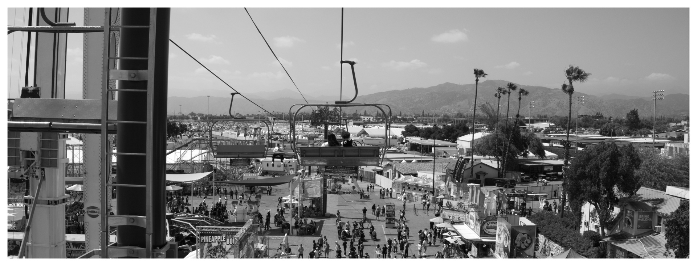

One of the most exciting parts about the early days of a hobby is learning stuff. You start out from the position of knowing nothing (or at least, very little), and through iteration and doing you learn SO much. Approaching hobbies as craft, unavoidably I end up optimizing and learning new ways to accomplish the same thing.

Two new photography tricks/beliefs that I've picked up lately:

# Blown-Out and Bright are Different Things
My first time learning the basics of photography was in 2009. By that point, digital workflows were commonplace, few people were actively shooting film, but the widespread availability of computational photography via smartphones had yet to happen. APS-C sensors were still relatively new (the first EF-S lenses from Canon made their debut in 2003), and the big difference compared to film or full-frame digital was the relative lack of dynamic range.

Unsurprisingly, the hype-y aesthetic du jour was High Dynamic Range (HDR). In particular, the kind of HDR look that you could achieve via bracketing - and then turned up to 11 via editing. This kind of look was especially common in real estate photography - indoors shots tend to be harshly lit when it's sunny out, and otherwise relatively dark. On reddit, [/r/shittyhdr](https://www.reddit.com/r/shittyHDR/) is a great place to see and lampoon the worst offenders.

The legacy of this time, at least in my photographic eye, is a reflexive fear of brightness. Of course, HDR as a method is designed to prevent clipping, but after looking at too many such photos, you begin to forget what makes something clipping as opposed to just bright. Bright skies in particular trigger this instinct in me - over the past few weeks I've found that I shy away from engaging with photos I take that have a visibly overcast sky, preferring instead a sky that is recognizably and vividly blue. There's nothing wrong with a nice blue sky photographically, of course - but, there's also nothing wrong with using the sky for contrast, rather than just for creating a sense of space and width.

Letting the sky be bright - perhaps even so bright as to be right on the border of clipping - is a great way of using creating contrast in a world that is dominated by dark mode.

# Forced Panorama
One of the more stunning physical camera effects I've seen is the cinematic panorama aspect ratio format created by the [Hasselblad XPan](https://www.hasselblad.com/about/history/xpan/). Perhaps unsurprisingly, the tail end of its heyday happens to overlap with my own start of photography.

The overwhelming wideness creates a cinematic effect (the aspect ratio being 65:24, or roughly 2.7:1, where anamorphic widescreen is 2.35:1 and the 70mm format uses a 2.76:1 ratio). Of course, XPans being film cameras that have retained their value stunningly well over the years, it is necessary to make my own "XPan at Home".

The solution, simply, is to take expansive wide-angle shots and crop them. It doesn't work well for all photos, but for ones where there is a lot of space that feels otherwise poorly utilized, cropping them to the XPan aspect can save the shot. 

Cropping is, understandably wasteful of pixels and a pale substitute to having the full resolution of film, but hey, that's the compromise necessary for XPan at Home.

